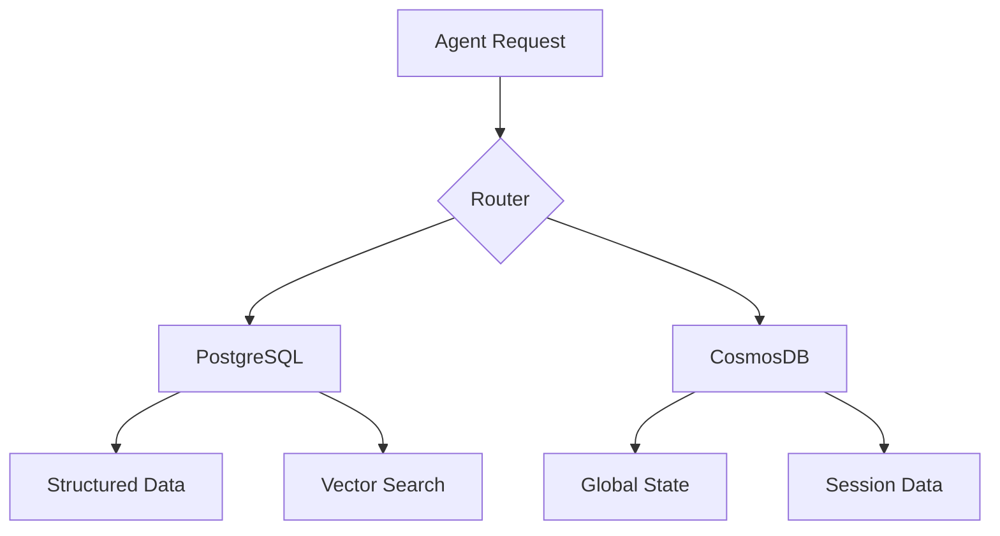

# Azure Foundry Agents Component Comparison

## Database Technology Comparison

### PostgreSQL vs CosmosDB

| Feature | PostgreSQL | CosmosDB | Notes |
|---------|------------|----------|-------|
| **Data Model** | Relational + Graph (with AGE) | Multi-model (Document, Graph, Key-value) | PostgreSQL requires extensions for non-relational models |
| **Scaling** | Vertical + Read Replicas | Automatic horizontal scaling | CosmosDB offers more flexible scaling options |
| **Graph Support** | Via Apache AGE | Native Gremlin support | Different query languages and capabilities |
| **Vector Search** | DiskANN + pgvector | Built-in vector search | Both support RAG patterns |
| **Global Distribution** | Manual configuration | Automatic multi-region | CosmosDB offers superior global distribution |
| **Consistency** | ACID compliance | Tunable consistency levels | Different approaches to consistency |

### Use Case Recommendations

#### Choose PostgreSQL when:
- Requiring strong ACID compliance
- Heavy relational data operations
- Complex SQL queries needed
- Cost-sensitive deployments
- Using DiskANN for high-dimensional vectors
- Integrating with existing PostgreSQL systems

#### Choose CosmosDB when:
- Global distribution required
- Multi-model data patterns
- Requiring automatic scaling
- Real-time data synchronization
- Complex graph operations
- High availability critical

## Integration with Azure AI Foundry

### Common Integration Points

1. **Model Context Protocol (MCP)**
   - Both databases support MCP server integration
   - Unified interface for data access
   - Standardized query patterns
   - Common semantic operations

2. **Vector Search**
   ```plaintext
   PostgreSQL:
   - DiskANN for high-dimensional vectors
   - Product Quantization support
   - Up to 16,000 dimensions

   CosmosDB:
   - Native vector search
   - Integrated similarity search
   - Optimized for RAG patterns
   ```

3. **Semantic Operations**
   ```plaintext
   PostgreSQL:
   - Semantic operators in SQL
   - Direct LLM integration
   - Natural language filtering

   CosmosDB:
   - Built-in semantic indexing
   - Natural language queries
   - Semantic search capabilities
   ```

### Azure Bot Service Integration

1. **Connection Patterns**
   ```plaintext
   PostgreSQL:
   - Direct connection via Bot Framework
   - MCP server integration
   - Custom middleware support

   CosmosDB:
   - Native Bot Framework storage
   - State management integration
   - Turn context persistence
   ```

2. **State Management**
   ```plaintext
   PostgreSQL:
   - Custom state tables
   - JSON storage for flexibility
   - Transaction-based updates

   CosmosDB:
   - Built-in state providers
   - Automatic scaling
   - Session management
   ```

## Architectural Patterns

### 1. Hybrid Storage Pattern



### 2. Data Synchronization Pattern

```plaintext
1. Primary Storage Selection
   - PostgreSQL for structured data
   - CosmosDB for global state
   - Sync critical data between systems

2. Synchronization Methods
   - Event-driven updates
   - Change feed processing
   - Batch synchronization
```

### 3. Search Optimization Pattern

```plaintext
Vector Search Strategy:
- Use DiskANN for high-dimensional local search
- Use CosmosDB for globally distributed search
- Implement cross-database search federation
```

## Performance Considerations

### 1. Query Performance

| Operation Type | PostgreSQL | CosmosDB |
|---------------|------------|-----------|
| Complex SQL | Excellent | Good |
| Graph Queries | Good (AGE) | Excellent |
| Vector Search | Excellent (DiskANN) | Very Good |
| Global Queries | Limited | Excellent |

### 2. Scaling Strategy

```plaintext
PostgreSQL:
- Vertical scaling primary
- Read replicas for read scaling
- Manual sharding if needed

CosmosDB:
- Automatic horizontal scaling
- Global distribution
- Multi-master replication
```

## Security Implementation

### 1. Authentication Methods

```plaintext
PostgreSQL:
- Role-based access control
- Row-level security
- Column-level encryption

CosmosDB:
- Azure AD integration
- Resource tokens
- Network-level isolation
```

### 2. Data Protection

```plaintext
Both Systems:
- Encryption at rest
- Encryption in transit
- Audit logging
- Threat protection
```

## Cost Optimization

### 1. Storage Costs

```plaintext
PostgreSQL:
- Predictable storage pricing
- Lower base costs
- Storage management required

CosmosDB:
- Pay-per-use model
- Global distribution costs
- Automatic management
```

### 2. Operation Costs

```plaintext
PostgreSQL:
- Lower transaction costs
- Manual optimization needed
- Traditional monitoring tools

CosmosDB:
- RU-based pricing
- Automatic optimization
- Built-in monitoring
```

## Development Experience

### 1. Tool Support

```plaintext
PostgreSQL:
- Extensive SQL tools
- pgAdmin, Azure Data Studio
- Traditional debugging

CosmosDB:
- Azure Portal integration
- Data Explorer
- Built-in diagnostics
```

### 2. Integration Support

```plaintext
Both Systems:
- Azure Functions integration
- Event Grid support
- Monitor integration
```

## Best Practices

### 1. Data Modeling

```plaintext
PostgreSQL:
- Normalize when appropriate
- Use JSON for flexibility
- Implement proper indexing

CosmosDB:
- Denormalize for performance
- Design for partition key
- Optimize for document size
```

### 2. Monitoring

```plaintext
PostgreSQL:
- Query performance analysis
- Resource utilization tracking
- Custom metric collection

CosmosDB:
- RU consumption monitoring
- Partition metrics
- Global replication lag
```

## References

- [Azure AI Foundry Documentation](https://learn.microsoft.com/en-us/azure/ai-foundry)
- [PostgreSQL Documentation](https://www.postgresql.org/docs/)
- [CosmosDB Documentation](https://learn.microsoft.com/en-us/azure/cosmos-db)
- [Azure Bot Service](https://learn.microsoft.com/en-us/azure/bot-service)
- [Model Context Protocol](https://learn.microsoft.com/en-us/azure/ai-foundry/concepts/mcp)
