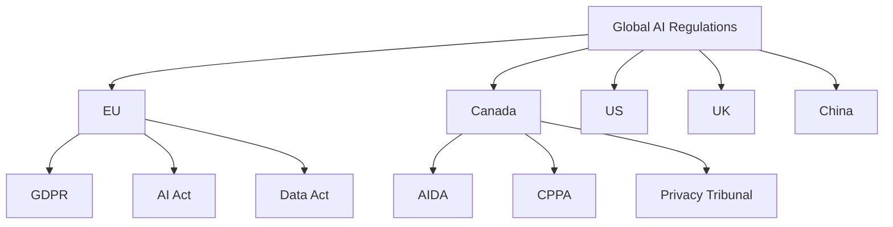
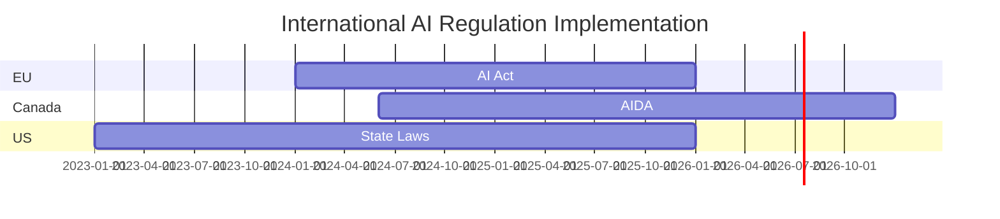

# International Alignment of AI and Privacy Regulations

## Global Framework Comparison

### Major Regulatory Frameworks

1. **European Union**
   - GDPR (2018)
   - AI Act (2024)
   - Data Act (2024)
   
2. **United States**
   - State Privacy Laws (CCPA, CPRA, VCDPA)
   - AI Bill of Rights
   - NIST AI Risk Management Framework

3. **Canada**
   - Bill C-27 (AIDA)
   - CPPA
   - Privacy Tribunal Act

4. **United Kingdom**
   - Data Protection Act 2018
   - AI Regulation White Paper (2023)
   - National AI Strategy

5. **China**
   - Personal Information Protection Law
   - AI Governance Regulations
   - Data Security Law

## UN Alignment

### Sustainable Development Goals (SDGs)
1. SDG 9: Industry, Innovation, and Infrastructure
   - AI governance alignment
   - Digital infrastructure development
   - Innovation frameworks

2. SDG 16: Peace, Justice, and Strong Institutions
   - Privacy protection
   - Digital rights
   - Institutional accountability

### UN AI Initiatives
- UNESCO AI Ethics Framework
- ITU AI for Good
- UNICRI Centre for AI and Robotics

## Cross-Border Data Flows

### Adequacy Decisions
- EU-Canada
- UK-Canada
- Japan-Canada

### Data Transfer Mechanisms
- Standard Contractual Clauses
- Binding Corporate Rules
- Codes of Conduct

## AI Risk Categories

### High-Risk Systems
- Biometric identification
- Critical infrastructure
- Law enforcement
- Healthcare systems

### Medium-Risk Systems
- Customer service AI
- Automated decision support
- Marketing systems

### Low-Risk Systems
- Basic automation
- Entertainment AI
- Educational tools

## Implementation Timelines

### Phase 1: 2024-2025
- Framework establishment
- Guidelines publication
- Industry consultation

### Phase 2: 2025-2026
- Initial enforcement
- Compliance deadlines
- Review mechanisms

### Phase 3: 2026-2027
- Full implementation
- International coordination
- Framework updates

## Charts and Visualizations

### Regulatory Comparison Matrix

### Implementation Timeline

### Marimekko Chart: Privacy and AI Regulations by Region
[See marimekko_chart.md for detailed visualization]

## Resources

### Official Documentation
- [EU AI Act](https://digital-strategy.ec.europa.eu/en/policies/regulatory-framework-ai)
- [US AI Bill of Rights](https://www.whitehouse.gov/ostp/ai-bill-of-rights/)
- [UK AI White Paper](https://www.gov.uk/government/publications/ai-regulation-a-pro-innovation-approach)

### Research and Analysis
- [OECD AI Policy Observatory](https://oecd.ai/)
- [World Economic Forum AI Governance](https://www.weforum.org/topics/artificial-intelligence)
- [Brookings Institution AI Research](https://www.brookings.edu/topic/artificial-intelligence/)
