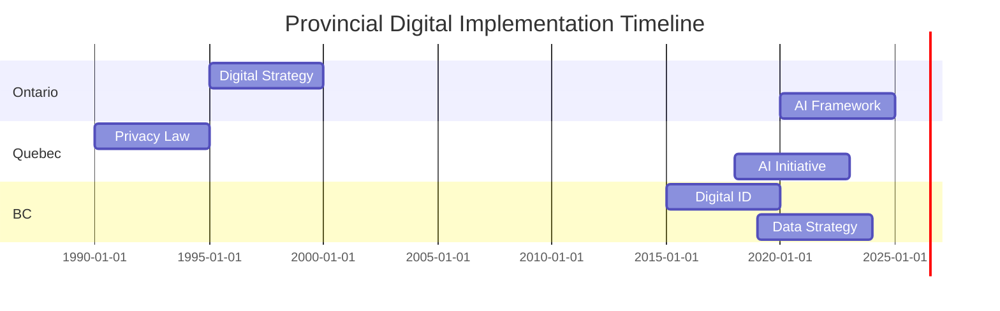

# Provincial Information Technology Legislation (1980-Present)

## Overview

This document provides a comprehensive analysis of provincial information technology legislation across Canada from 1980 to the present, including the impact on industry development and policy evolution.

## Quick Navigation

### By Province
- [Ontario](provinces/ontario.md)
- [Quebec](provinces/quebec.md)
- [British Columbia](provinces/british_columbia.md)
- [Alberta](provinces/alberta.md)
- [Nova Scotia](provinces/nova_scotia.md)
- [Other Provinces](provinces/other_provinces.md)

### By Topic
- [Privacy Legislation](topics/privacy.md)
- [Digital Governance](topics/digital_governance.md)
- [AI Regulation](topics/ai_regulation.md)
- [Data Protection](topics/data_protection.md)

## Timeline Overview

### 1980s: Early Computing Era
- Introduction of personal computers
- Initial electronic privacy concerns
- First electronic records legislation

### 1990s: Internet Revolution
- Web technology adoption
- E-commerce emergence
- Digital signature legislation

### 2000s: Digital Government
- E-government initiatives
- Privacy protection frameworks
- Data security standards

### 2010s: Mobile and Cloud
- Mobile device policies
- Cloud computing regulations
- Open data initiatives

### 2020s: AI and Advanced Analytics
- AI governance frameworks
- Algorithmic transparency
- Data sovereignty requirements

## Provincial Leadership Analysis

### Ontario
- Technology corridor development
- Innovation hubs establishment
- Digital government strategy

### Quebec
- French language technology requirements
- AI research leadership
- Privacy framework innovation

### British Columbia
- Digital identity initiatives
- Open data leadership
- Privacy protection innovation

### Alberta
- Energy sector digitization
- Cybersecurity framework
- Data center initiatives

## Industry Impact Analysis

### Technology Sector Growth
- Employment statistics
- Investment trends
- Innovation metrics

### Policy Influence
- Regulatory frameworks
- Industry standards
- International alignment

### Economic Development
- Regional development
- Sector specialization
- Innovation clusters

## Key Government Leaders

### 1980s Leaders
- Provincial premiers
- Technology ministers
- Policy architects

### 1990s Leaders
- Digital strategy developers
- Privacy commissioners
- Industry ministers

### 2000s Leaders
- E-government champions
- Security policy makers
- Innovation leaders

### 2010s Leaders
- Digital transformation leads
- Data governance experts
- Privacy modernizers

### 2020s Leaders
- AI policy makers
- Digital rights advocates
- Innovation ministers

## Legislative Evolution

### Privacy Protection
1. First-generation privacy laws
2. Digital privacy updates
3. Modern privacy frameworks

### Digital Government
1. E-government foundations
2. Service modernization
3. Digital-first approaches

### Technology Regulation
1. Basic computing rules
2. Internet era regulations
3. AI governance frameworks

## Implementation Timelines

## Resources

### Government Archives
- Provincial legislative archives
- Policy documents
- Implementation guides

### Industry Reports
- Economic impact studies
- Technology adoption reports
- Innovation metrics

### Academic Research
- Policy analysis papers
- Impact studies
- Comparative research

## Navigation
- [Back to Main Analysis](../README.md)
- [Implementation Playbook](../playbook/README.md)
- [International Comparison](../international_alignment/README.md)
