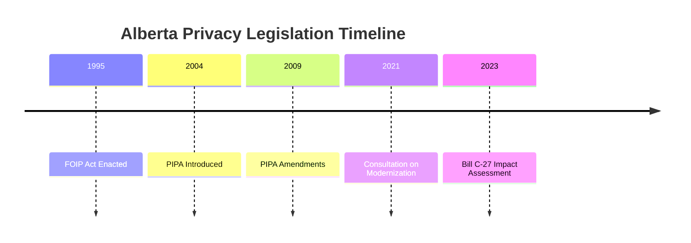

# Alberta Privacy Legislation Analysis

## Key Legislation

### Personal Information Protection Act (PIPA)
- Private sector privacy law
- Consent requirements
- Collection, use, and disclosure
- Employee information handling

### Freedom of Information and Protection of Privacy Act (FOIP)
- Public sector privacy law
- Information access rights
- Privacy protection
- Government transparency

## Timeline

## Regulatory Framework

### Office of the Information and Privacy Commissioner
- Independent oversight
- Investigation powers
- Order-making authority
- Educational mandate

### Scope of Application
- Private businesses
- Non-profit organizations
- Professional regulatory organizations
- Public bodies

## Key Requirements

### Consent Management
- Forms of consent
- Exceptions to consent
- Withdrawal of consent
- Documentation requirements

### Privacy Impact Assessments
- When required
- Assessment criteria
- Review process
- Documentation standards

### Data Security
- Reasonable safeguards
- Administrative measures
- Technical controls
- Physical security

## Alignment with Bill C-27

### Areas of Harmony
- Privacy protection principles
- Consent framework
- Breach notification
- Enforcement approach

### Key Differences
- Provincial jurisdiction
- Scope of application
- Penalty structure
- Enforcement mechanisms

## Implementation Guidance

### Organizations Must
- Appoint privacy officer
- Develop privacy policies
- Implement security measures
- Train employees

### Documentation Requirements
- Privacy policies
- Consent records
- Security measures
- Breach response plans

## Resources
- [Office of the Information and Privacy Commissioner of Alberta](https://www.oipc.ab.ca/)
- [PIPA Resources](https://www.oipc.ab.ca/action-items/privacy-impact-assessments.aspx)
- [FOIP Guidelines](https://www.oipc.ab.ca/resources/guidelines-and-practices-2009-foip.aspx)
