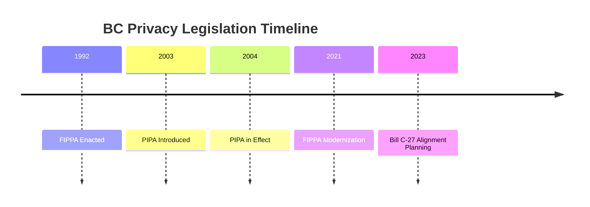

# British Columbia Privacy Legislation Analysis

## Key Legislation

### Freedom of Information and Protection of Privacy Act (FIPPA)
- Public sector privacy law
- Access to information
- Protection of personal information
- Data residency requirements

### Personal Information Protection Act (PIPA)
- Private sector privacy law
- Collection, use, and disclosure rules
- Employee personal information
- Breach notification requirements

## Timeline

## Data Residency Requirements

### Public Sector
- Data must be stored in Canada
- Limited exceptions
- Security requirements
- Access controls

### Private Sector
- No strict residency requirements
- Disclosure rules
- Consent requirements
- International transfer considerations

## Key Areas of Focus

### Public Bodies
- Universities and colleges
- Crown corporations
- Government ministries
- Local governments

### Private Organizations
- Businesses
- Non-profits
- Professional associations
- Charities

## Alignment with Bill C-27

### Areas of Overlap
- Privacy protection principles
- Consent requirements
- Breach notification
- Enforcement mechanisms

### Key Differences
- Data residency requirements
- Scope of application
- Enforcement structure
- Penalty framework

## Implementation Considerations

### Technology Requirements
- Data storage location
- Security measures
- Access controls
- Audit capabilities

### Process Changes
- Privacy impact assessments
- Breach reporting procedures
- Consent management
- Records management

## Resources
- [Office of the Information & Privacy Commissioner](https://www.oipc.bc.ca/)
- [FIPPA Resources](https://www2.gov.bc.ca/gov/content/governments/services-for-government/information-management-technology/privacy)
- [PIPA Guidance](https://www.oipc.bc.ca/guidance-documents/)
