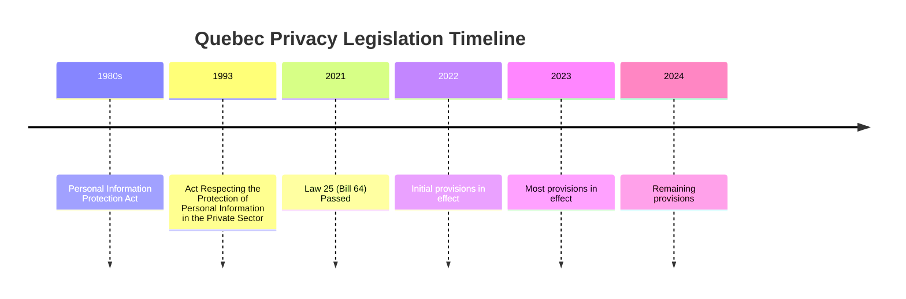

# Quebec Privacy Legislation Analysis

## Key Legislation

### Law 25 (formerly Bill 64)
- Modernization of Privacy Laws
- Enhanced consent requirements
- Mandatory breach notification
- Privacy impact assessments
- Right to data portability

## Timeline

## Compliance Requirements

### Data Protection Officer
- Mandatory appointment
- Required qualifications
- Responsibilities and duties
- Reporting structure

### Privacy Impact Assessments
- When required
- Assessment criteria
- Documentation requirements
- Review process

### Cross-Border Data Transfer
- Impact assessments
- Contractual requirements
- Jurisdictional considerations
- Security measures

## Penalties and Enforcement
- Administrative penalties up to $10M or 2% of worldwide turnover
- Criminal penalties
- Powers of the Commission d'accès à l'information (CAI)
- Appeals process

## Key Differences from Bill C-27
- Stricter consent requirements
- More detailed privacy impact assessment criteria
- Different monetary penalties structure
- Provincial jurisdiction considerations

## Implementation Timeline
- September 2022: Initial provisions
- September 2023: Core provisions
- September 2024: Data portability requirements

## Resources
- [Commission d'accès à l'information](https://www.cai.gouv.qc.ca/)
- [Law 25 Full Text](https://www.legisquebec.gouv.qc.ca/)
- [Implementation Guidelines](https://www.cai.gouv.qc.ca/documents/CAI_Guide_pratique_loi_64_EN.pdf)
