# Global AI and Privacy Legislation Comparison

## Marimekko Chart - Global AI/Privacy Legislation Coverage

```mermaid
graph TD
    subgraph AI Regulation Coverage
        AI_EU[EU AI Act - 100%]
        AI_CA[Canada AIDA - 80%]
        AI_US[US State Laws - 40%]
        AI_UK[UK AI Guidelines - 60%]
    end
    
    subgraph Privacy Protection
        P_EU[EU GDPR - 100%]
        P_CA[Canada CPPA - 85%]
        P_US[US State Laws - 65%]
        P_UK[UK DPA - 90%]
    end
    
    subgraph Enforcement Mechanisms
        E_EU[EU - Fines up to 6% Revenue]
        E_CA[Canada - Up to $25M or 5%]
        E_US[US - Varies by State]
        E_UK[UK - Up to £17.5M or 4%]
    end
```

## Regulatory Scope Comparison

| Jurisdiction | AI Systems | Privacy | Data Protection | Penalties | Implementation |
|-------------|------------|---------|-----------------|-----------|----------------|
| EU (AI Act + GDPR) | Comprehensive | Strict | Strong | High | 2024-2025 |
| Canada (C-27) | Moderate | Strong | Strong | Moderate | 2024-2025 |
| US (State Laws) | Limited | Varied | Varied | Varied | Ongoing |
| UK | Guidance-based | Strong | Strong | High | Ongoing |

## Key Features Matrix

### Artificial Intelligence
- Risk-based categorization
- Impact assessments
- Transparency requirements
- Testing and validation
- Human oversight

### Privacy Protection
- Consent requirements
- Data subject rights
- Cross-border transfers
- Breach notification
- Data minimization

### Implementation Timelines
- EU: 2024-2025
- Canada: 2024-2025
- US: Varies by state
- UK: Ongoing development

## Resources
- [EU AI Act](https://digital-strategy.ec.europa.eu/en/policies/regulatory-framework-ai)
- [GDPR](https://gdpr.eu/)
- [Bill C-27](https://www.parl.ca/DocumentViewer/en/44-1/bill/C-27/first-reading)
- [UK AI White Paper](https://www.gov.uk/government/publications/ai-regulation-a-pro-innovation-approach)
