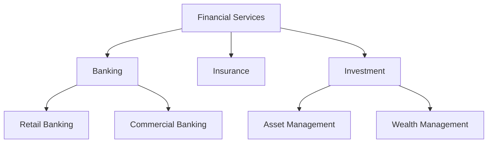
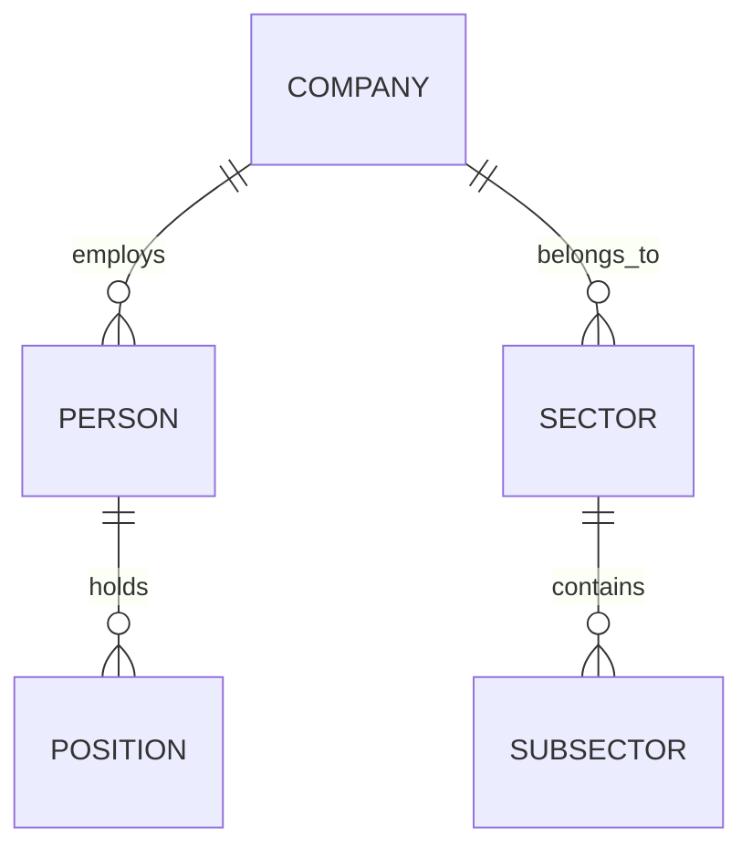
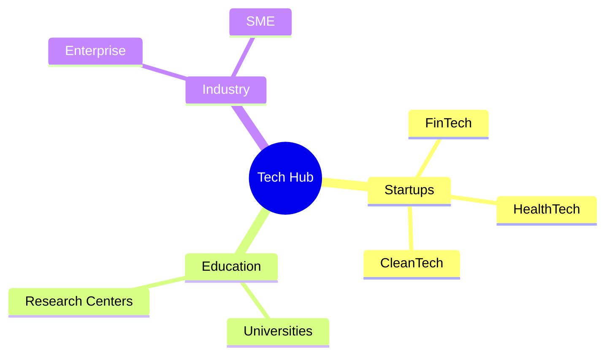
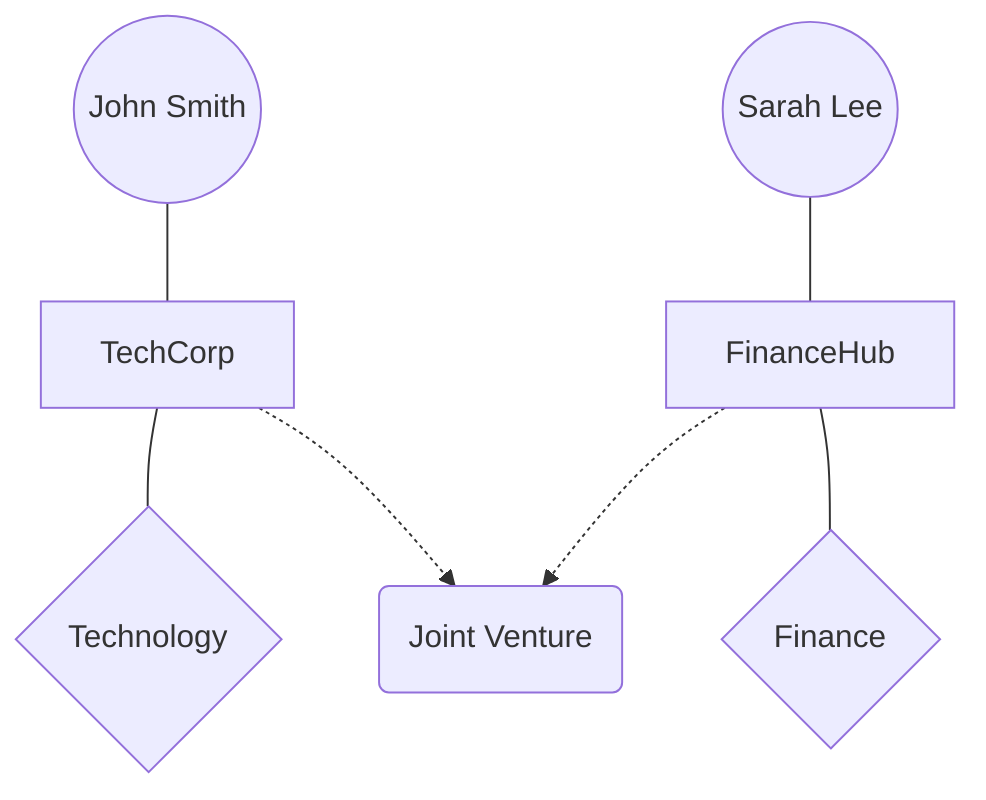
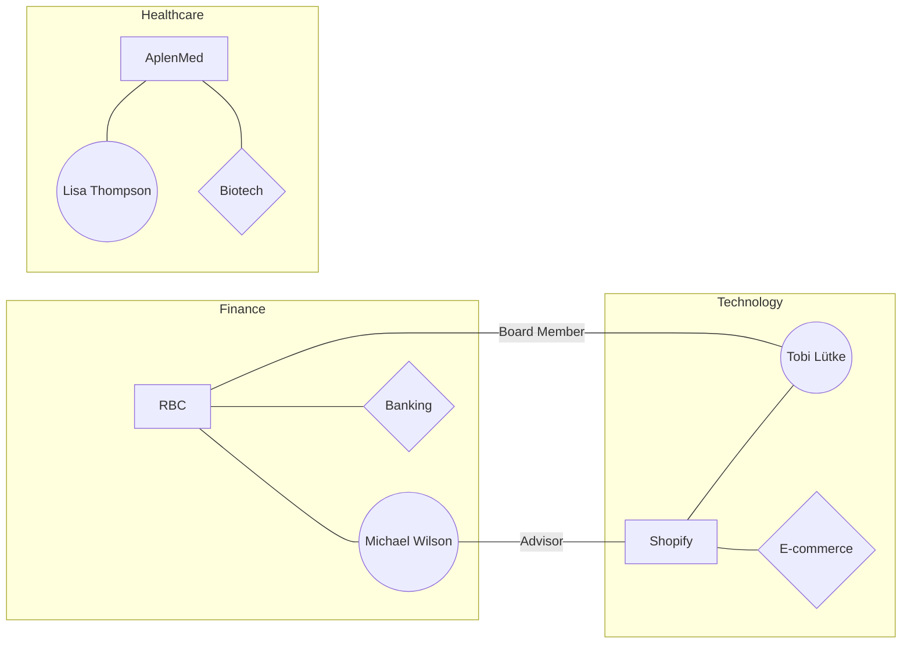
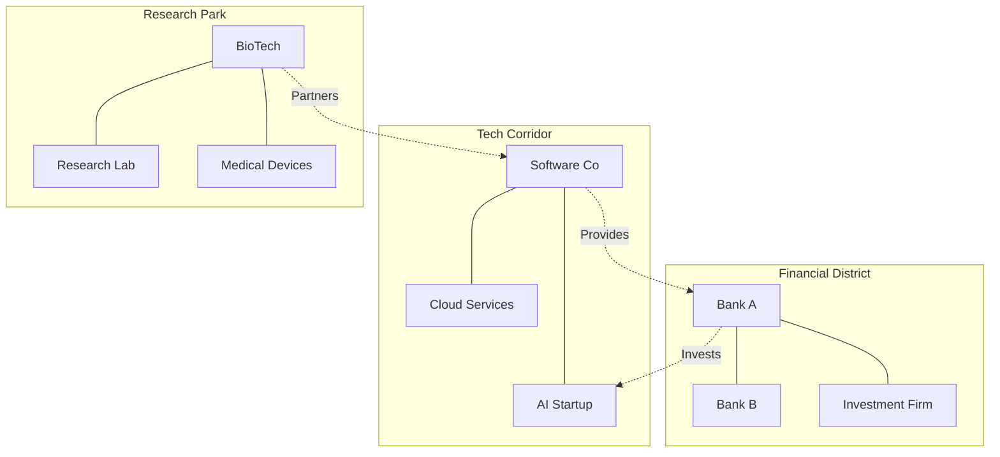
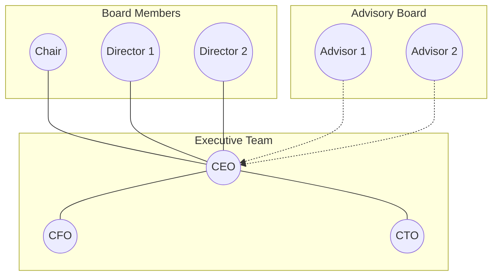

# Relationship Diagrams for Business Data Analytics

This guide explores various approaches to visualizing complex relationships between people, companies, and industry sectors using Mermaid diagrams. We'll examine different diagram types and their suitability for representing graph-style relationships.

## Graph Types and Their Use Cases

### 1. Flow Charts
Best for: Hierarchical relationships and decision processes


### 2. Entity Relationship Diagrams
Best for: Database-style relationships and complex interconnections


### 3. Mind Maps
Best for: Conceptual relationships and brainstorming


### 4. Network Graphs (Using Graph TD/LR)
Best for: Social networks and influence mapping


## Building Relationship Networks

### Company-Person-Industry Network


## Generating Dynamic Diagrams from Data

### Data Structure Example
```json
{
    "entities": {
        "people": [
            {
                "id": "P1",
                "name": "John Smith",
                "title": "CEO",
                "company": "C1"
            }
        ],
        "companies": [
            {
                "id": "C1",
                "name": "TechCorp",
                "sector": "S1"
            }
        ],
        "sectors": [
            {
                "id": "S1",
                "name": "Technology",
                "subsectors": ["AI", "Cloud"]
            }
        ]
    },
    "relationships": [
        {
            "from": "P1",
            "to": "C1",
            "type": "leads"
        }
    ]
}
```

### Python Code to Generate Mermaid Diagrams
```python
def generate_mermaid_network(data):
    mermaid = ["graph LR"]
    
    # Add nodes
    for person in data["entities"]["people"]:
        mermaid.append(f'    {person["id"]}(("{person["name"]}"))')
    
    for company in data["entities"]["companies"]:
        mermaid.append(f'    {company["id"]}["{company["name"]}"]')
    
    # Add relationships
    for rel in data["relationships"]:
        mermaid.append(f'    {rel["from"]} --{rel["type"]}--- {rel["to"]}')
    
    return "\n".join(mermaid)
```

## Advanced Visualization Patterns

### Industry Cluster Analysis


### Leadership Network Analysis


## Best Practices for Graph Visualization

1. Hierarchical Layout
   - Use top-to-bottom for organizational structures
   - Use left-to-right for process flows
   - Consider subgraphs for logical grouping

2. Visual Elements
   - Circles for people ((.))
   - Rectangles for companies [.]
   - Diamonds for decision points {.}
   - Dashed lines for indirect relationships -.->
   - Solid lines for direct relationships ---

3. Data Organization
   - Maintain consistent node IDs
   - Use clear relationship types
   - Group related entities in subgraphs
   - Include metadata for filtering

4. Performance Considerations
   - Limit nodes per diagram (<50 for readability)
   - Use subgraphs for complex networks
   - Consider interactive filtering
   - Implement lazy loading for large datasets

## Tools for Large-Scale Graph Generation

1. Neo4j Integration
```python
from neo4j import GraphDatabase

def query_relationships(tx, limit):
    return tx.run("""
        MATCH (p:Person)-[r]->(c:Company)
        RETURN p, r, c LIMIT $limit
    """, limit=limit)

def convert_to_mermaid(records):
    nodes = set()
    relationships = []
    
    for record in records:
        # Process nodes and relationships
        pass
    
    return generate_mermaid_diagram(nodes, relationships)
```

2. GraphQL Implementation
```graphql
query RelationshipNetwork {
  people {
    id
    name
    position
    companyConnections {
      role
      company {
        id
        name
        sector
      }
    }
  }
}
```

This guide demonstrates various approaches to visualizing complex business relationships using Mermaid diagrams. The choice of diagram type depends on the specific use case, data complexity, and visualization goals. For implementation, consider the data structure, tooling requirements, and performance implications when working with large-scale relationship networks.
