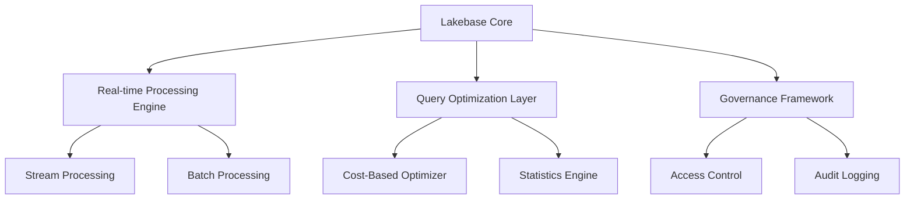
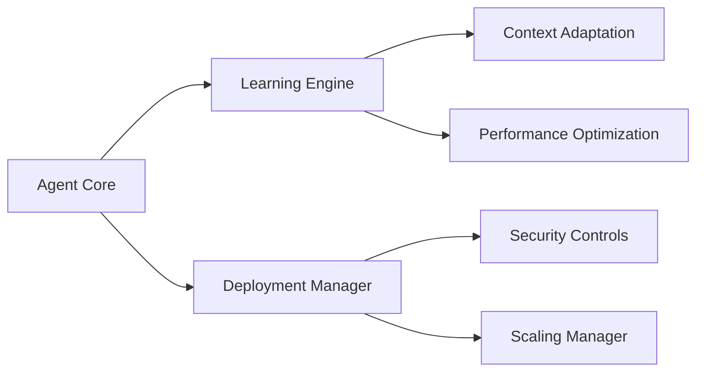
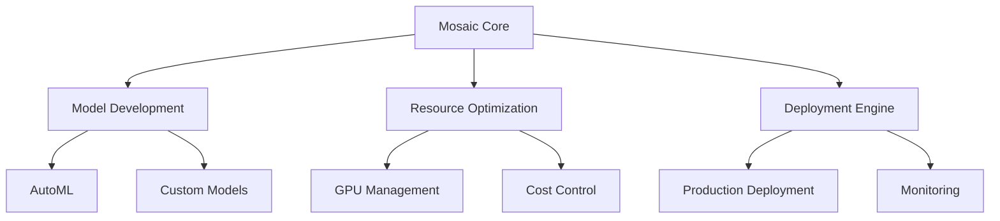

# Data and AI Summit 2025 Announcements and Developments

The Data and AI Summit 2025 represents a watershed moment in the evolution of data management and artificial intelligence, introducing transformative technologies that reshape how organizations approach their data and AI initiatives. This repository contains comprehensive documentation of the key announcements and their implications for the industry.

## June 2025 Major Releases

### Lakebase: Redefining Data Architecture
Lakebase introduces a revolutionary approach to data architecture, seamlessly merging data lake flexibility with traditional database structures. Key features include:

#### Architecture Components

#### Integration Ecosystem
- Native Delta Lake support
- Apache Spark compatibility
- Real-time analytics capabilities
- Advanced query optimization
- Enterprise-grade security features

### Agent Bricks: Advanced AI Automation
Agent Bricks represents the next generation of AI deployment platforms, featuring:

#### Core Capabilities

#### Key Features
- Auto-optimized AI agent deployment
- Context-aware learning mechanisms
- Enterprise security integration
- Scalable deployment architecture
- Real-time performance monitoring

### MLflow 3.0: Unified ML Lifecycle Management
MLflow 3.0 introduces comprehensive improvements to machine learning workflows:

#### Core Enhancements
- New LoggedModel entity for unified versioning
- Enhanced tracing capabilities
- Multi-framework integration
- Advanced deployment options

#### Supported Frameworks
- LangChain
- DSPy
- LlamaIndex
- OpenAI
- AutoGen
- Anthropic
- CrewAI

### Mosaic AI: Enterprise AI Platform
Mosaic AI delivers a comprehensive suite for enterprise AI development:

#### Platform Architecture

#### Enterprise Features
- Advanced model optimization
- Scalable workload management
- Enterprise security controls
- Comprehensive monitoring
- Cost optimization tools

## Implementation Resources

### Documentation and Guides
- Lakebase Documentation: https://docs.databricks.com/lakebase/
- Agent Bricks Guide: https://docs.databricks.com/agent-bricks/
- MLflow 3.0 Documentation: https://mlflow.org/docs/latest/
- Mosaic AI Platform: https://docs.databricks.com/mosaic/

### Training Resources
- Level 400 Courses
  - Advanced Data Architecture
  - Enterprise AI Implementation
  - MLflow for Scale
  - Security and Governance

- Level 500 Courses
  - Lakebase Internals
  - Agent Bricks Development
  - MLflow Core Development
  - Custom AI Platform Extensions

### External Resources and Blog Posts
- Lakebase Public Preview: https://www.databricks.com/blog/announcing-lakebase-public-preview
- Agent Bricks: https://www.databricks.com/blog/introducing-agent-bricks
- MLflow 3.0: https://www.databricks.com/blog/mlflow-30-unified-ai-experimentation-observability-and-governance
- Mosaic AI: https://www.databricks.com/blog/mosaic-ai-announcements-data-ai-summit-2025

### Community and Support
- Databricks Community Forums: https://community.databricks.com
- GitHub Repositories
  - MLflow: https://github.com/mlflow/mlflow
  - Databricks Documentation: https://github.com/databricks/tech-docs
  - Example Projects: https://github.com/databricks/examples

These announcements represent Databricks' commitment to innovation in data management and artificial intelligence, providing organizations with the tools needed to build and scale sophisticated data and AI solutions. The integration of these technologies offers a comprehensive ecosystem for modern enterprise data architecture and AI development.