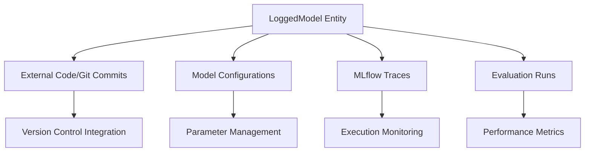
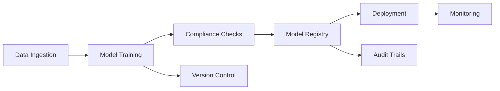
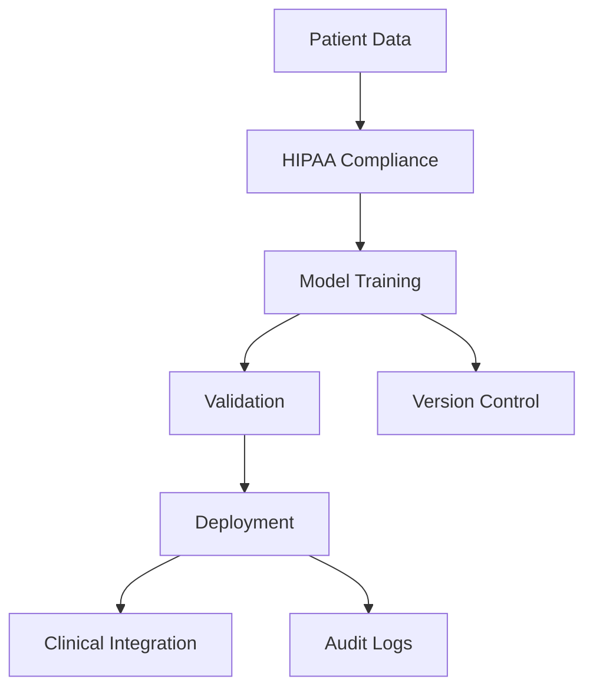

# MLflow 3.0: A New Era in Machine Learning Lifecycle Management

MLflow 3.0 represents a significant evolution in machine learning lifecycle management, introducing groundbreaking features that enhance experimentation, observability, and governance. This comprehensive update reflects the changing landscape of AI development, with particular emphasis on supporting both traditional machine learning and modern GenAI workflows.

## Core Architecture Enhancements

### Improved Model Tracking for GenAI
MLflow 3.0 introduces a sophisticated versioning mechanism specifically designed for GenAI applications. The new LoggedModel entity serves as a central metadata hub, creating seamless connections between:

### Enhanced Tracing Capabilities
- Synchronous/asynchronous generators support
- Auto-tracing for Async OpenAI
- Custom request/response preview functionality
- Integration with multiple frameworks:
  - LangChain
  - DSPy
  - LlamaIndex
  - OpenAI
  - AutoGen
  - Anthropic
  - CrewAI

## Breaking Changes and Migrations

### Core Framework Changes
Several significant architectural changes have been implemented to streamline MLflow's core functionality:

1. MLflow Recipes Removal
   - Complete removal of MLflow Recipes (formerly MLflow Pipelines)
   - Migration path: Utilize standard MLflow tracking and model registry

2. Model Flavor Changes
   - Removal of fastai flavor
   - Removal of mleap flavor
   - Migration to ONNX or MLflow pyfunc recommended

### API Modernization
- TensorFlow autologging improvements
- Enhanced fluent APIs for tracking
- Thread and multi-process safety in fluent APIs

## Implementation in Various Verticals

### Financial Services

### Healthcare

## Competitive Landscape

### Open Source Alternatives
1. DVC (Data Version Control)
   - GitHub: https://github.com/iterative/dvc
   - Focus: Data and model versioning
   - Strength: Git-like interface for ML

2. Weights & Biases
   - Platform: https://wandb.ai
   - Focus: Experiment tracking
   - Strength: Real-time visualization

### Enterprise Solutions
1. Azure ML
   - Focus: Enterprise ML lifecycle
   - Integration: Deep Azure ecosystem integration
   - Website: https://azure.microsoft.com/services/machine-learning/

2. Amazon SageMaker
   - Focus: End-to-end ML platform
   - Integration: AWS services
   - Website: https://aws.amazon.com/sagemaker/

## Advanced Training Resources

### Level 400 Course Content
1. Advanced MLflow Architecture
   - System Design Deep Dive
   - Custom Plugin Development
   - Performance Optimization
   - Course Link: https://www.databricks.com/learn/training/mlflow-advanced-architecture

2. Enterprise Integration Patterns
   - Security Implementation
   - Scalability Patterns
   - High Availability Setup
   - Course Link: https://www.databricks.com/learn/training/mlflow-enterprise-integration

### Level 500 Course Content
1. MLflow Internals and Contributions
   - Core Component Development
   - Advanced Plugin Architecture
   - Performance Tuning
   - Course Link: https://www.databricks.com/learn/training/mlflow-internals

2. Custom MLflow Extension Development
   - Custom Flavor Creation
   - Advanced Tracking Servers
   - Distributed Systems Integration
   - Course Link: https://www.databricks.com/learn/training/mlflow-extension-development

## Updated Features from MLflow Repository

### Model Training and Tracking
- Enhanced model tracking capabilities for logging multiple checkpoints
- Improved metric tracking precision
- Advanced experiment organization features
- Hierarchical runs with parent-child relationships

### Deployment and Serving
- FastAPI scoring server migration
- Enhanced tracing capabilities
- Support for various deployment patterns
- Advanced model serving configurations

### Integration and Tools
- Enhanced LangChain integration
- Improved OpenAI autologging
- DSPy flavor support
- Comprehensive LlamaIndex integration

## Resources and Links

### GitHub Repositories
- MLflow Core: https://github.com/mlflow/mlflow
- MLflow Examples: https://github.com/mlflow/mlflow-example
- MLflow Models: https://github.com/mlflow/mlflow-models

### Documentation
- Official Documentation: https://mlflow.org/docs/latest/
- API Reference: https://mlflow.org/docs/latest/api.html
- Deployment Guide: https://mlflow.org/docs/latest/deployment/index.html

### Community and Support
- MLflow Forums: https://discuss.mlflow.org
- Stack Overflow: https://stackoverflow.com/questions/tagged/mlflow
- Monthly Community Calls: https://mlflow.org/community/

This comprehensive update to MLflow 3.0 demonstrates Databricks' commitment to advancing machine learning infrastructure while maintaining robust support for traditional ML workflows and embracing modern AI development patterns.
