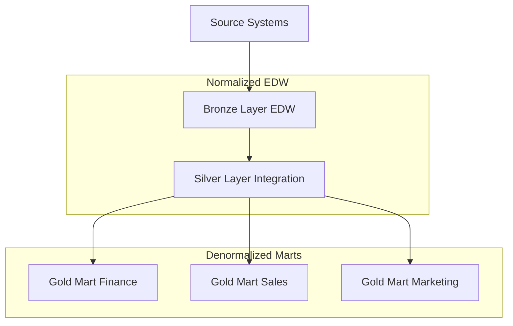
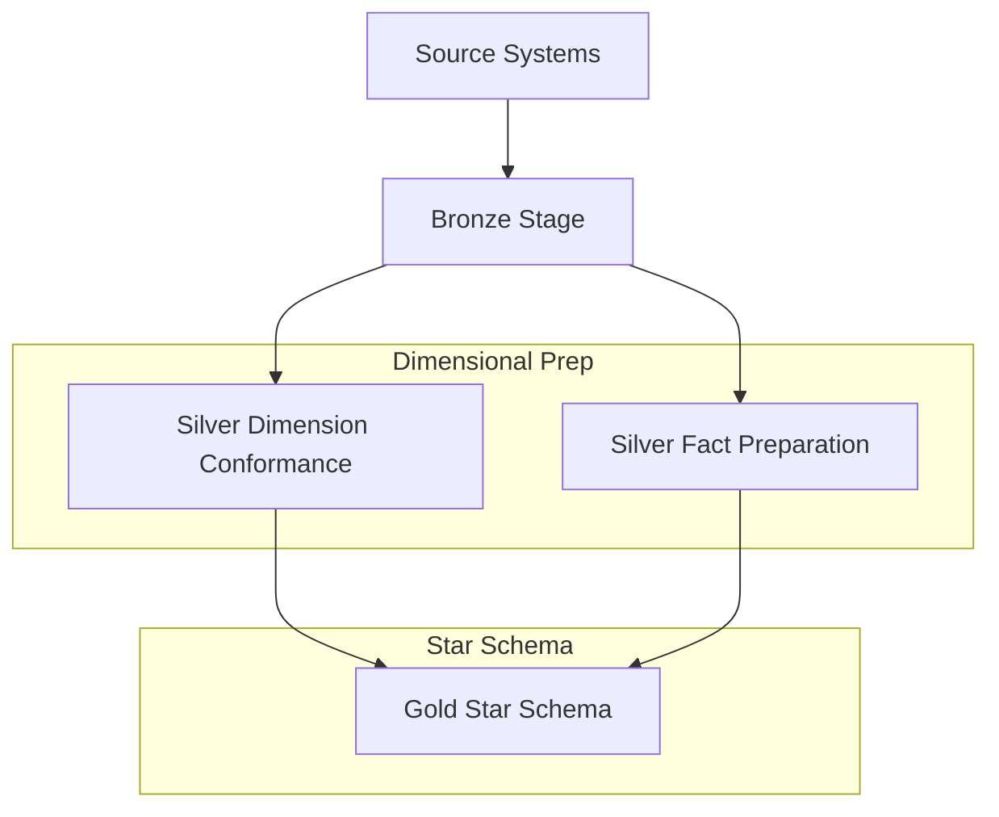

# Inmon vs Kimball: Implementing Medallion Architecture

## Architectural Approaches

### Inmon's Approach to Medallion

The Inmon approach would implement the medallion architecture with these characteristics:

1. **Bronze Layer (Enterprise Data Warehouse)**
   - Highly normalized (3NF) structure
   - Enterprise-wide scope
   - Atomic level data
   - Temporal consistency

2. **Silver Layer (Integration)**
   - Maintains normalization
   - Enterprise-wide data relationships
   - Historical tracking
   - Data quality enforcement

3. **Gold Layer (Data Marts)**
   - Denormalized for specific business areas
   - Derived from silver layer
   - Subject-oriented
   - Department-specific views



### Kimball's Approach to Medallion

The Kimball approach would implement the medallion architecture differently:

1. **Bronze Layer (Stage)**
   - Raw data landing
   - Temporary staging
   - Minimal transformation
   - Source system preservation

2. **Silver Layer (Conformance)**
   - Conformed dimensions
   - Business process aligned
   - Star schema preparation
   - Quality rules applied

3. **Gold Layer (Presentation)**
   - Star schema implementation
   - Dimensional models
   - Fact tables
   - Business process metrics



## Implementation Differences

### Data Modeling

#### Inmon
```sql
-- Bronze Layer (3NF)
CREATE TABLE Customer (
    CustomerID INT PRIMARY KEY,
    FirstName VARCHAR(50),
    LastName VARCHAR(50),
    Email VARCHAR(100)
)

CREATE TABLE Address (
    AddressID INT PRIMARY KEY,
    CustomerID INT FOREIGN KEY,
    AddressType VARCHAR(20),
    Street VARCHAR(100),
    City VARCHAR(50)
)

-- Silver Layer (Still Normalized)
CREATE TABLE CustomerIntegrated (
    CustomerID INT PRIMARY KEY,
    FirstName VARCHAR(50),
    LastName VARCHAR(50),
    Email VARCHAR(100),
    ValidFrom DATETIME,
    ValidTo DATETIME
)

-- Gold Layer (Denormalized Mart)
CREATE TABLE CustomerMart (
    CustomerKey INT PRIMARY KEY,
    FullName VARCHAR(100),
    Email VARCHAR(100),
    PrimaryAddress VARCHAR(200),
    CustomerSegment VARCHAR(50)
)
```

#### Kimball
```sql
-- Bronze Layer (Stage)
CREATE TABLE CustomerStage (
    SourceKey VARCHAR(50),
    SourceSystem VARCHAR(20),
    RawData NVARCHAR(MAX)
)

-- Silver Layer (Conformance)
CREATE TABLE DimCustomer (
    CustomerKey INT PRIMARY KEY,
    CustomerID VARCHAR(50),
    FullName VARCHAR(100),
    Email VARCHAR(100),
    EffectiveDate DATETIME,
    ExpirationDate DATETIME
)

-- Gold Layer (Star Schema)
CREATE TABLE FactSales (
    SalesKey INT PRIMARY KEY,
    CustomerKey INT,
    ProductKey INT,
    DateKey INT,
    SalesAmount DECIMAL(18,2),
    Quantity INT
)
```

## Key Differences

| Aspect | Inmon Medallion | Kimball Medallion |
|--------|----------------|-------------------|
| Bronze Layer | Normalized EDW | Staging Area |
| Silver Layer | Integration Layer | Conformance Layer |
| Gold Layer | Subject-Specific Marts | Star Schema |
| Data Model | 3NF → 3NF → Denormalized | Raw → Conformed → Star |
| Scope | Enterprise First | Business Process First |
| Integration | Centralized | Dimensional |
| Granularity | Atomic Throughout | Mixed Granularity |

## Modern Considerations (2025)

1. **Cloud Scale**
   - Both approaches can leverage cloud elasticity
   - Normalized storage is less costly than historically
   - Query engines handle both models efficiently

2. **Real-time Analytics**
   - Kimball's approach easier for real-time marts
   - Inmon's approach better for enterprise history
   - Hybrid approaches becoming common

3. **Data Mesh Influence**
   - Domain-driven design affects both approaches
   - Distributed ownership changing EDW concept
   - Product thinking influencing marts

4. **Technology Impact**
   - Columnar storage benefits both approaches
   - Lake houses supporting both paradigms
   - Query federation reducing physical copies

## Best Practice Recommendations

1. **Choose Based On:**
   - Enterprise vs Department scope
   - Real-time vs Historical focus
   - Query patterns and users
   - Development team expertise

2. **Hybrid Considerations:**
   - Use Inmon's EDW for master data
   - Apply Kimball's dimensions for analytics
   - Leverage cloud storage for both
   - Implement data quality at both levels

## References

- [Inmon vs Kimball](https://www.ssp.sh/brain/inmon-vs-kimball/)
- [Data Warehouse Architecture](https://www.ssp.sh/brain/classical-architecture-of-data-warehouse)
- [Modern Data Stack Evolution](https://medium.com/towardsdev/data-modeling-in-the-modern-data-stack-d29be964b3a7)
