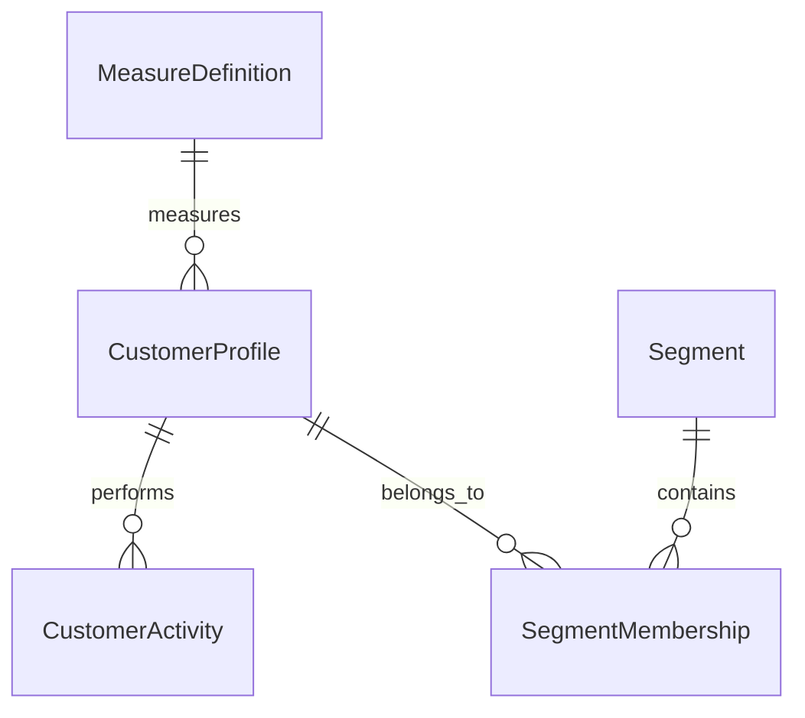
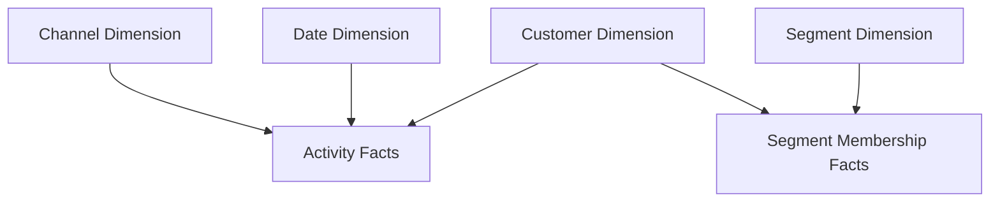
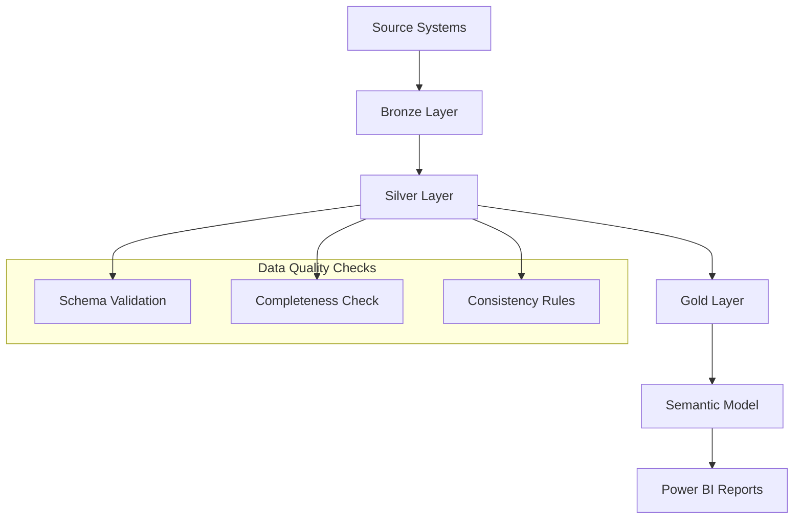

# Dynamics 365 Customer Insights Medallion Architecture Example

This document demonstrates how to implement a medallion architecture for Customer Insights data using Microsoft Fabric.

## Data Model Overview

### Common Data Model Tables


## Medallion Implementation

### Bronze Layer (Raw Data)

Raw tables preserving source system data exactly as received:

```sql
.create table BronzeCustomerProfile (
    CustomerId: string,
    SourceSystem: string,
    RawData: dynamic,
    IngestionTime: datetime
)

.create table BronzeCustomerActivity (
    ActivityId: string,
    CustomerId: string,
    SourceSystem: string,
    RawData: dynamic,
    IngestionTime: datetime
)

.create table BronzeSegment (
    SegmentId: string,
    SourceSystem: string,
    RawData: dynamic,
    IngestionTime: datetime
)
```

### Silver Layer (Standardized)

Cleaned and conformed data following Common Data Model schemas:

```sql
.create table SilverCustomerProfile (
    CustomerId: string,
    Type: string,              -- Person/Organization
    FirstName: string,
    LastName: string,
    Email: string,
    Phone: string,
    CompanyName: string,
    CreatedDate: datetime,
    ModifiedDate: datetime,
    ProcessedDate: datetime
)

.create table SilverCustomerActivity (
    ActivityId: string,
    CustomerId: string,
    ActivityType: string,
    Channel: string,
    Value: decimal,
    ActivityDate: datetime,
    ProcessedDate: datetime
)

.create table SilverSegment (
    SegmentId: string,
    Name: string,
    Description: string,
    Criteria: dynamic,
    ModifiedDate: datetime,
    ProcessedDate: datetime
)
```

### Gold Layer (Business)

Business-ready views and aggregations:

```sql
-- Customer 360 View
.create materialized-view GoldCustomer360 on table SilverCustomerProfile {
    SilverCustomerProfile
    | lookup kind=leftouter 
        (SilverCustomerActivity 
        | summarize 
            LastActivity=max(ActivityDate),
            TotalValue=sum(Value),
            ActivityCount=count()
        by CustomerId) 
        on CustomerId
    | lookup kind=leftouter
        (SilverSegment | join kind=inner 
            SegmentMembership on SegmentId
        | summarize Segments=make_list(Name) by CustomerId)
        on CustomerId
}

-- Customer Activity Trends
.create materialized-view GoldActivityTrends on table SilverCustomerActivity {
    SilverCustomerActivity
    | summarize 
        DailyActivity=count(),
        DailyValue=sum(Value)
    by bin(ActivityDate, 1d), ActivityType, Channel
}

-- Segment Analytics
.create materialized-view GoldSegmentAnalytics on table SilverSegment {
    SilverSegment 
    | join kind=inner SegmentMembership on SegmentId
    | join kind=inner SilverCustomerProfile on CustomerId
    | summarize 
        MemberCount=count(),
        AvgCustomerValue=avg(TotalValue)
    by SegmentId, Name, Description
}
```

## Semantic Model Design

### Star Schema for Analytics



### Measures and KPIs

```sql
-- Customer Lifetime Value
TotalCustomerValue = 
    CALCULATE(
        SUM(FactActivity[Value]),
        ALLEXCEPT(DimCustomer, DimCustomer[CustomerId])
    )

-- Customer Engagement Score
EngagementScore = 
    CALCULATE(
        COUNT(FactActivity[ActivityId]) * 
        AVERAGE(FactActivity[Value]) /
        MAX(FactActivity[Value])
    )

-- Segment Performance
SegmentPerformance = 
    DIVIDE(
        CALCULATE(
            SUM(FactActivity[Value]),
            FILTER(
                ALL(DimSegment),
                DimSegment[SegmentId] = EARLIER(DimSegment[SegmentId])
            )
        ),
        CALCULATE(
            SUM(FactActivity[Value]),
            ALL(DimSegment)
        )
    )
```

## Data Flow Implementation



## Best Practices

1. **Data Quality**
   - Implement validation rules at Silver layer
   - Track data quality metrics
   - Monitor completeness and accuracy

2. **Performance**
   - Partition large tables by date
   - Implement appropriate indexing
   - Use materialized views for common queries

3. **Security**
   - Implement row-level security
   - Mask sensitive data in Silver layer
   - Control access by layer

4. **Monitoring**
   - Track processing times
   - Monitor data volumes
   - Alert on quality issues

## References

- [Common Data Model Schemas](https://learn.microsoft.com/en-us/common-data-model/)
- [Customer Insights Documentation](https://learn.microsoft.com/en-us/dynamics365/customer-insights/)
- [Fabric Best Practices](https://learn.microsoft.com/en-us/fabric/)
