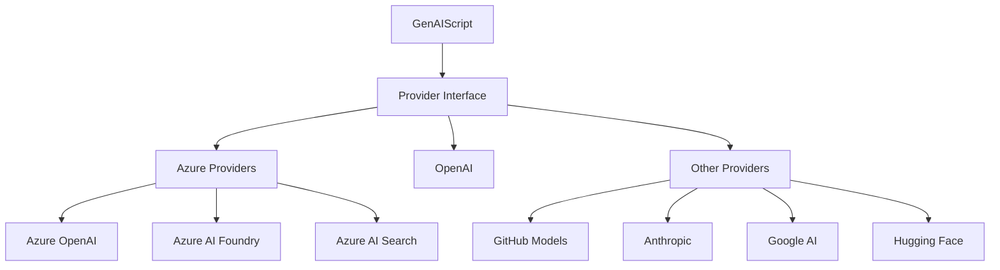
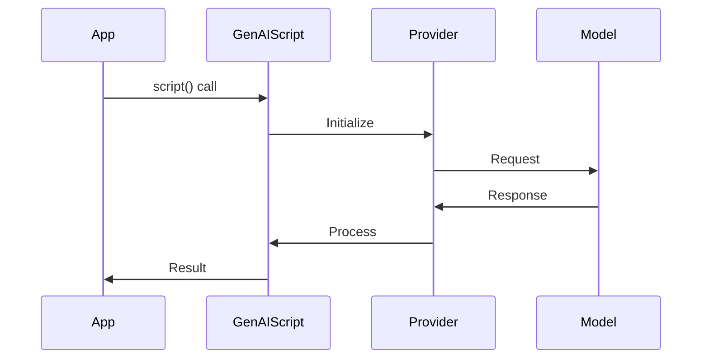

# GenAIScript Providers Guide

## Overview

GenAIScript supports multiple LLM providers, each with their own capabilities, configurations, and best practices. This guide covers the main providers and how to effectively use them in your applications.

## Provider Architecture



## Core Providers

### 1. Azure OpenAI
```javascript
// Configuration
script({
  model: "azure:deployment-id"
})

// Environment setup
AZURE_OPENAI_API_KEY=...
AZURE_OPENAI_API_ENDPOINT=https://....openai.azure.com
```

**Features:**
- Full OpenAI model compatibility
- Enterprise-grade security
- Azure integration
- Regional deployments

### 2. Azure AI Foundry
```javascript
// Direct model access
script({
  model: "azure_ai_inference:model-id"
})

// Serverless deployment
script({
  model: "azure_serverless:deployment-id"
})
```

**Features:**
- Serverless deployment
- Pay-per-token pricing
- Multiple model support
- Azure infrastructure

### 3. OpenAI
```javascript
// Configuration
script({
  model: "openai:gpt-4"
})

// Environment setup
OPENAI_API_KEY=...
```

**Features:**
- Latest models
- Research access
- High performance
- Global availability

### 4. GitHub Models
```javascript
// Configuration
script({
  model: "github:openai/gpt-4"
})
```

**Features:**
- GitHub integration
- Copilot compatibility
- Enterprise features
- Team collaboration

## Additional Providers

### 1. Anthropic
```javascript
// Configuration
script({
  model: "anthropic:claude-3"
})

// Environment
ANTHROPIC_API_KEY=...
```

### 2. Google AI
```javascript
// Configuration
script({
  model: "google:gemini-pro"
})

// Environment
GOOGLE_API_KEY=...
```

### 3. Hugging Face
```javascript
// Configuration
script({
  model: "huggingface:model-id"
})

// Environment
HUGGINGFACE_API_KEY=...
```

## Local Providers

### 1. Ollama
```javascript
// Configuration
script({
  model: "ollama:llama2"
})
```

### 2. LocalAI
```javascript
// Configuration
script({
  model: "localai:model-id"
})
```

## Provider Selection Guide

### 1. Enterprise Use Cases
- Azure OpenAI
- Azure AI Foundry
- GitHub Models

### 2. Research & Development
- OpenAI
- Anthropic
- Google AI

### 3. Local Development
- Ollama
- LocalAI
- LM Studio

## Provider Features Matrix

| Provider | Enterprise Ready | Fine-tuning | Vision | Embeddings | Cost |
|----------|-----------------|-------------|---------|------------|------|
| Azure OpenAI | ✅ | ✅ | ✅ | ✅ | $$ |
| Azure AI Foundry | ✅ | ✅ | ✅ | ✅ | $$ |
| OpenAI | ⚠️ | ✅ | ✅ | ✅ | $$ |
| GitHub Models | ✅ | ❌ | ✅ | ✅ | $$$ |
| Anthropic | ⚠️ | ❌ | ✅ | ❌ | $$ |
| Google AI | ⚠️ | ❌ | ✅ | ✅ | $$ |
| Hugging Face | ⚠️ | ✅ | ✅ | ✅ | $ |
| Ollama | ❌ | ❌ | ✅ | ✅ | Free |
| LocalAI | ❌ | ❌ | ❌ | ✅ | Free |

## Provider-Specific Features

### Azure OpenAI
- RBAC integration
- Private networking
- Regional compliance
- Enterprise support

### Azure AI Foundry
- Serverless deployment
- Pay-per-use pricing
- Multiple model support
- Azure integration

### OpenAI
- Latest models
- High performance
- Global availability
- Research features

### GitHub Models
- GitHub integration
- Team features
- Enterprise support
- VS Code integration

## Best Practices By Provider

### Azure OpenAI
```javascript
// Best practice configuration
script({
  model: "azure:deployment-id",
  security: {
    contentFilters: true,
    rateLimit: true
  },
  monitoring: {
    metrics: true,
    logging: true
  }
})
```

### Azure AI Foundry
```javascript
// Best practice configuration
script({
  model: "azure_ai_inference:model-id",
  optimization: {
    caching: true,
    batching: true
  }
})
```

### OpenAI
```javascript
// Best practice configuration
script({
  model: "openai:gpt-4",
  rateLimit: {
    requestsPerMinute: 60
  },
  retry: {
    attempts: 3,
    backoff: true
  }
})
```

## Provider Flow Paths



## Migration Between Providers

### OpenAI to Azure OpenAI
```javascript
// Before
script({
  model: "openai:gpt-4"
})

// After
script({
  model: "azure:deployment-id"
})
```

### Local to Cloud
```javascript
// Before
script({
  model: "ollama:llama2"
})

// After
script({
  model: "azure_ai_inference:llama2"
})
```

## Provider Icons

### Cloud Providers
- Azure: 🔷
- OpenAI: 🟢
- GitHub: ⚫
- Google: 🔴
- Anthropic: 🟣

### Local Providers
- Ollama: 🟡
- LocalAI: 🟠
- LM Studio: 🟤

## Troubleshooting By Provider

### Azure Services
```javascript
// Diagnostic checks
const diagnostics = await runDiagnostics({
  provider: "azure",
  checks: ["auth", "quota", "network"]
})
```

### OpenAI
```javascript
// Health checks
const health = await checkHealth({
  provider: "openai",
  tests: ["api", "models", "rate-limits"]
})
```

### Local Providers
```javascript
// System checks
const system = await checkSystem({
  provider: "ollama",
  requirements: ["gpu", "memory", "disk"]
})
```

## Additional Resources

- [Provider Documentation](https://microsoft.github.io/genaiscript/configuration/)
- [Azure Services](https://learn.microsoft.com/en-us/azure/ai-services/)
- [OpenAI API](https://platform.openai.com/docs/api-reference)
- [GitHub Models](https://docs.github.com/en/copilot)
- [Anthropic Documentation](https://docs.anthropic.com/)
- [Google AI Documentation](https://cloud.google.com/ai-platform/docs)
- [Hugging Face Documentation](https://huggingface.co/docs)
