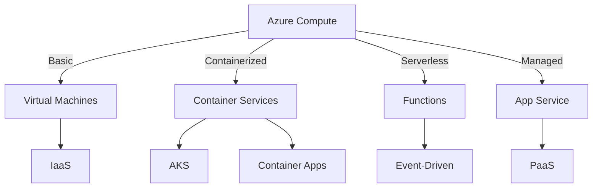
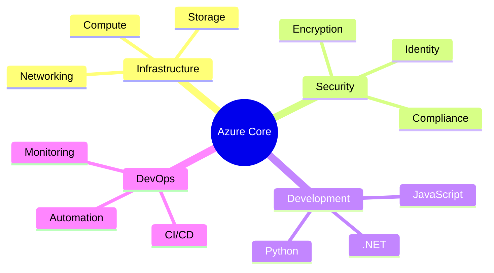
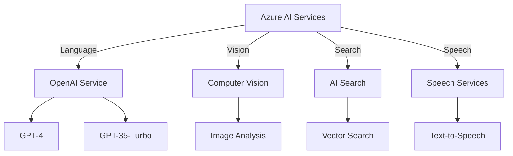
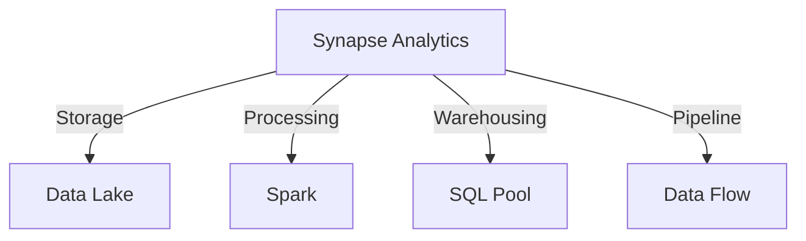
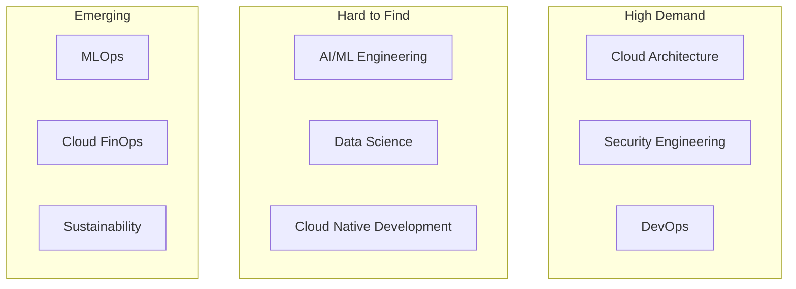
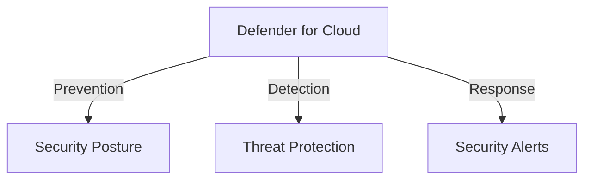
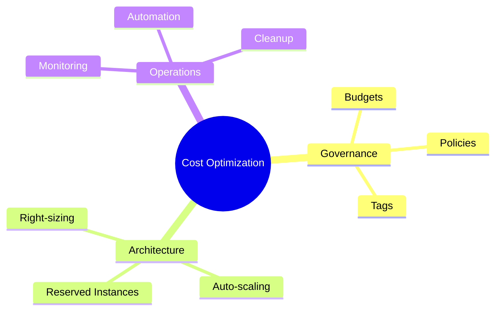
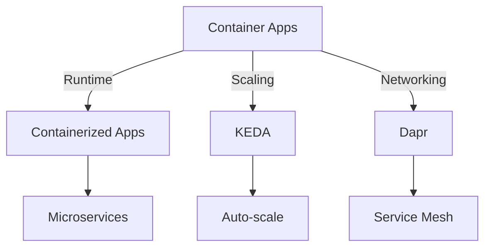

# Microsoft Technology Guide 2025

## Table of Contents
1. [Azure Core Services](#azure-core-services)
2. [AI and Machine Learning](#ai-and-machine-learning)
3. [Data and Analytics](#data-and-analytics)
4. [Security and Compliance](#security-and-compliance)
5. [Developer Tools](#developer-tools)
6. [Cloud-Native Development](#cloud-native-development)

## Azure Core Services

### Compute Services 101


#### Documentation
- [Azure Virtual Machines](https://learn.microsoft.com/azure/virtual-machines/)
- [Azure Kubernetes Service](https://learn.microsoft.com/azure/aks/)
- [Azure Functions](https://learn.microsoft.com/azure/azure-functions/)
- [Azure App Service](https://learn.microsoft.com/azure/app-service/)

#### Pricing Models
1. Virtual Machines
   - Pay-as-you-go: $0.02-$0.50/hour
   - Reserved Instances: Up to 72% savings
   - Spot Instances: Up to 90% savings

2. Container Services
   - AKS: Free orchestration, pay for nodes
   - Container Apps: Pay per second of execution

3. Functions
   - Consumption plan: Pay per execution
   - Premium plan: From $0.20/hour

### Required Skills Tree


### Certifications Path
1. Fundamental Level
   - [AZ-900: Azure Fundamentals](https://learn.microsoft.com/certifications/azure-fundamentals/)
   - Duration: 2-3 weeks
   - Cost: $99

2. Associate Level
   - [AZ-104: Azure Administrator](https://learn.microsoft.com/certifications/azure-administrator/)
   - Duration: 2-3 months
   - Cost: $165

3. Expert Level
   - [AZ-305: Azure Solutions Architect](https://learn.microsoft.com/certifications/azure-solutions-architect/)
   - Duration: 6 months
   - Cost: $165

## AI and Machine Learning

### Azure AI Services Overview


#### Latest Certifications (2025)
1. Azure AI Fundamentals
   - Prerequisites: None
   - Focus: Machine learning basics, AI workloads
   - Renewal: 12 months

2. Azure Data Scientist Associate
   - Prerequisites: 2+ years experience
   - Focus: MLOps, Azure Machine Learning
   - Key Skills:
     - MLflow implementation
     - Pipeline optimization
     - Model deployment
     - Azure AI Foundry

3. Azure Developer Associate
   - Focus: End-to-end solutions
   - Key Skills:
     - Azure Functions
     - Web Apps
     - Storage solutions
     - API development

### Implementation Guide
1. Environment Setup
   - Azure Machine Learning workspace
   - Compute resources
   - Storage configuration

2. Model Development
   ```mermaid
   sequenceDiagram
       participant D as Developer
       participant AML as Azure ML
       participant CR as Compute
       
       D->>AML: Create experiment
       AML->>CR: Provision compute
       D->>AML: Submit training
       CR->>AML: Run experiment
       AML->>D: Return metrics
   ```

3. Production Deployment
   - CI/CD pipeline setup
   - Monitoring configuration
   - Scale settings

## Data and Analytics

### Azure Synapse Analytics 101


#### Pricing Structure
1. Serverless SQL Pool
   - Query processing: $5.65/TB
   - Storage: $25/TB/month

2. Dedicated SQL Pool
   - From $1.51/DWU/hour
   - Pause when not in use

### Skill Market Analysis


## Security and Compliance

### Microsoft Defender for Cloud 101


#### Pricing Models
- Free tier: Basic security features
- Standard tier: From $0.15/node/hour
- Enterprise: Custom pricing

### Vertical Solutions

#### Financial Services
- Regulatory compliance
- Fraud detection
- Secure transactions
- Data sovereignty

#### Healthcare
- HIPAA compliance
- Patient data security
- Medical device security
- Audit trails

#### Retail
- Payment security
- Customer data protection
- Supply chain security
- PCI compliance

## Azure Spend Optimization

### Cost Management Strategies


### ROI Acceleration
1. Quick Wins
   - Enable auto-shutdown for dev/test
   - Implement resource tagging
   - Use reserved instances

2. Medium-term
   - Optimize storage tiers
   - Implement auto-scaling
   - Utilize spot instances

3. Long-term
   - Modernize applications
   - Implement FinOps practices
   - Optimize data lifecycle

## Skills Development Resources

### Learning Paths
1. Azure Fundamentals
   - Duration: 1-2 months
   - [Microsoft Learn Path](https://learn.microsoft.com/azure/fundamentals/)
   - Cost: Free

2. Role-Based Training
   - Duration: 3-6 months
   - [Microsoft Learn Roles](https://learn.microsoft.com/training/browse/)
   - Cost: Free content, certification extra

3. Advanced Specializations
   - Duration: 6-12 months
   - [Microsoft Learn Enterprise](https://learn.microsoft.com/training/enterprise/)
   - Cost: Enterprise subscription required

## Cloud-Native Development

### Azure Container Apps


#### Best Practices 2025

1. Microservices Architecture
   - Service isolation
   - Independent scaling
   - Deployment flexibility

2. DevOps Integration
   ```mermaid
   sequenceDiagram
       participant Dev as Developer
       participant GH as GitHub
       participant ACA as Container Apps
       
       Dev->>GH: Push code
       GH->>GH: Build container
       GH->>ACA: Deploy revision
       ACA->>ACA: Health check
       ACA->>Dev: Status update
   ```

3. Security Implementation
   - Managed identities
   - Network isolation
   - Secret management

### Performance Optimization

1. Caching Strategy
   - Redis Cache
   - CDN integration
   - In-memory caching

2. Monitoring Setup
   ```mermaid
   graph LR
    A[Application] -->|Metrics| B[App Insights]
    A -->|Logs| C[Log Analytics]
    B --> D[Azure Monitor]
    C --> D
    D -->|Alerts| E[Action Groups]
   ```

3. Cost Management
   - Resource tagging
   - Budget alerts
   - Consumption tracking

This comprehensive guide provides a foundation for understanding Microsoft technologies, their implementation, and the skills required for successful adoption. For specific vertical solutions or detailed implementation guides, consult the official Microsoft documentation or engage with certified Microsoft partners.
