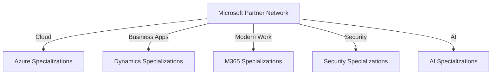
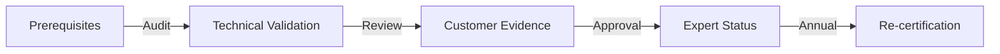
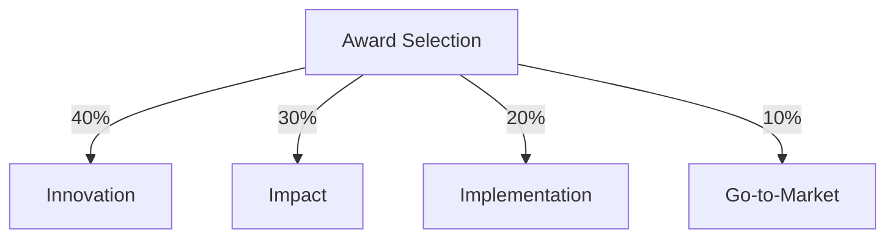
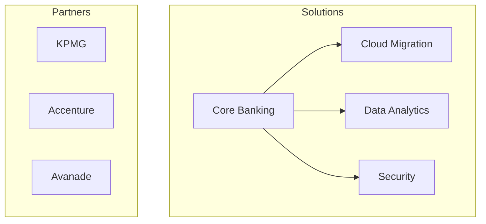
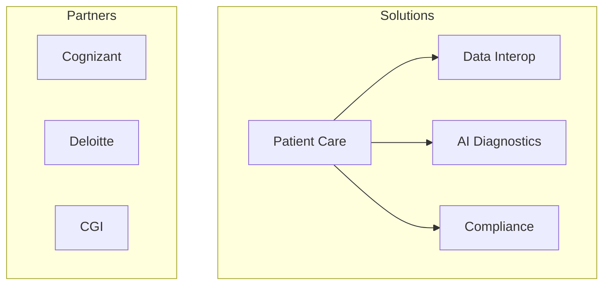
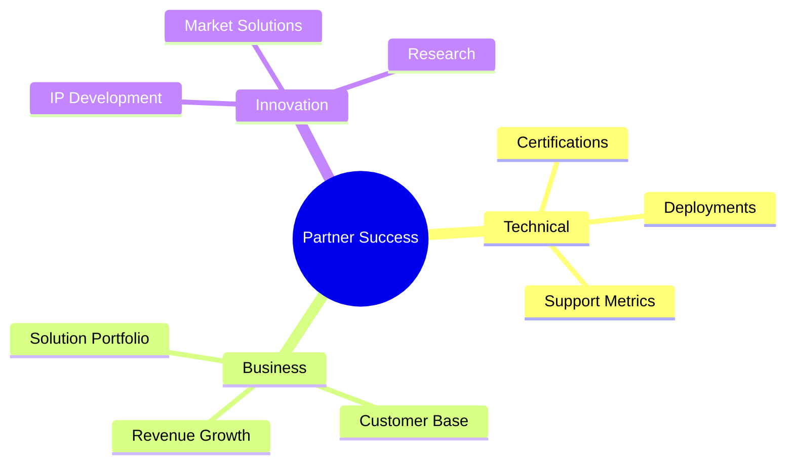
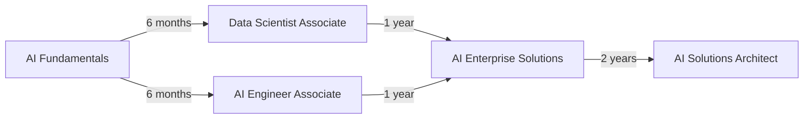
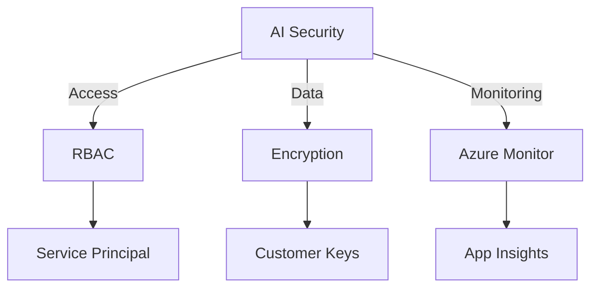

# Microsoft Partner Specializations 2025

## Partner Program Overview

### Specialization Paths


## Azure Solution Areas

### Infrastructure and Cloud Native
Top 5 Partners:

1. Avanade
   - Founded: 2000
   - CEO: Pam Maynard
   - Awards: 2024 Global Azure SI Partner of the Year
   - Notable Projects: Enterprise cloud transformation for Fortune 500 companies
   - Website: https://www.avanade.com
   - Timeline:
     ```mermaid
     timeline
         2000 : Founded
         2005 : First Global Azure Partner
         2015 : Digital Innovation Award
         2020 : Cloud Migration Excellence
         2024 : Global SI Partner
     ```

2. Accenture
   - Founded: 1989
   - CEO: Julie Sweet
   - Awards: 2024 Digital Transformation Partner
   - Website: https://www.accenture.com
   - Specializations: Cloud Migration, App Modernization

3. KPMG
   - Founded: 1987 (Merger)
   - CEO: Paul Knopp (US)
   - Awards: 2024 Industry Solutions Partner
   - Website: https://www.kpmg.com
   - Specializations: Industry Cloud Solutions

4. Cognizant
   - Founded: 1994
   - CEO: Ravi Kumar S
   - Awards: 2024 Cloud Innovation Partner
   - Website: https://www.cognizant.com
   - Specializations: Cloud-Native Development

5. Capgemini
   - Founded: 1967
   - CEO: Aiman Ezzat
   - Awards: 2024 Sustainability Partner
   - Website: https://www.capgemini.com
   - Specializations: Cloud Sustainability

### Data and AI
Top Partners:

1. DataBricks
   - Founded: 2013
   - CEO: Ali Ghodsi
   - Awards: 2024 Analytics Partner of the Year
   - Website: https://databricks.com
   - Key Innovations: Lakehouse Architecture
   ```mermaid
   timeline
       2013 : Founded
       2017 : Azure Partnership
       2020 : Unified Analytics
       2023 : AI Foundation Models
       2025 : Global Scale
   ```

2. Snowflake
   - Founded: 2012
   - CEO: Frank Slootman
   - Awards: 2024 Data Platform Partner
   - Website: https://www.snowflake.com
   - Specializations: Data Cloud Solutions

3. SAS
   - Founded: 1976
   - CEO: Jim Goodnight
   - Awards: 2024 Analytics Innovation
   - Website: https://www.sas.com
   - Specializations: Advanced Analytics

### Security and Compliance
Top Partners:

1. Palo Alto Networks
   - Founded: 2005
   - CEO: Nikesh Arora
   - Awards: 2024 Security Partner of the Year
   - Website: https://www.paloaltonetworks.com
   ```mermaid
   timeline
       2005 : Founded
       2015 : Cloud Security
       2020 : AI-Powered Defense
       2024 : Zero Trust Leader
   ```

2. CrowdStrike
   - Founded: 2011
   - CEO: George Kurtz
   - Awards: 2024 Endpoint Security Partner
   - Website: https://www.crowdstrike.com
   - Specializations: Endpoint Protection

## Partner Qualification Requirements

### Azure Expert MSP
Requirements:
- $100,000 monthly Azure consumption
- Advanced specializations in key areas
- Customer success evidence
- Technical capability validation

Process:


### Advanced Specializations
Requirements by Area:

1. Cloud Native
   - 5+ certified architects
   - 10+ successful deployments
   - Customer references
   ```mermaid
   mindmap
     root((Cloud Native))
       Prerequisites
         Technical Skills
         Project History
         Certifications
       Validation
         Architecture Review
         Customer Evidence
         Technical Assessment
   ```

2. Data & AI
   - AI/ML certified professionals
   - Proven ML deployments
   - Industry solutions

3. Security
   - Security certified staff
   - Compliance frameworks
   - Incident response capability

## Award Categories and Criteria

### Partner of the Year Awards
Selection Criteria:


### Evaluation Process
1. Submission Phase
   - Project documentation
   - Success metrics
   - Customer testimonials

2. Technical Review
   - Architecture validation
   - Best practices alignment
   - Innovation assessment

3. Business Impact
   - Revenue growth
   - Customer satisfaction
   - Market influence

## Industry Solutions

### Financial Services
Top Implementation Partners:


### Healthcare
Specialized Partners:


## Partner Success Metrics

### KPI Framework


## AI and Advanced Analytics Specializations

### Certification Path


### Top AI Partners 2025

1. OpenAI
   - Partnership Level: Strategic
   - Focus: Large Language Models
   - Notable Projects: GPT-4 integration
   - Timeline:
     ```mermaid
     timeline
         2019 : Initial Partnership
         2020 : Azure Integration
         2022 : GPT-3 Exclusive
         2024 : Enterprise Solutions
         2025 : Advanced AI Services
     ```

2. Anthropic
   - Partnership Level: Gold
   - Focus: Responsible AI
   - Specializations: 
     - Claude Integration
     - Enterprise Security
   - Key Markets: Finance, Healthcare

3. Databricks
   - Partnership Level: Gold
   - Focus: MLOps & Analytics
   - Notable Achievement: 2025 AI Platform Partner
   - Specializations:
     - Lakehouse Architecture
     - Enterprise ML

### Implementation Requirements

#### Infrastructure
- Azure ML Workspace
- Azure OpenAI Service
- AI Search
- Cognitive Services

#### Security & Compliance


#### Partner Success Metrics
1. Technical Validation
   - AI model performance
   - Scale testing results
   - Security compliance

2. Business Impact
   - Customer success stories
   - ROI metrics
   - Market expansion

This comprehensive guide outlines Microsoft's partner ecosystem, specialization paths, and success criteria for 2025. For specific partnership opportunities or detailed requirements, consult the Microsoft Partner Network documentation or engage with Microsoft Partner Development Managers.
