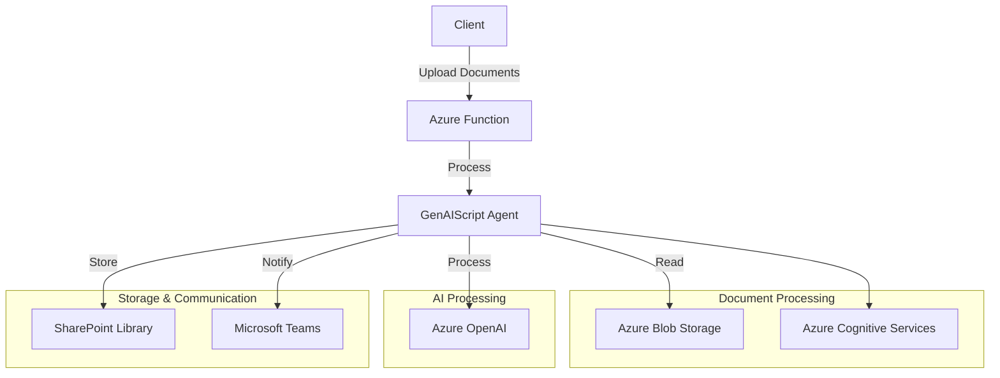
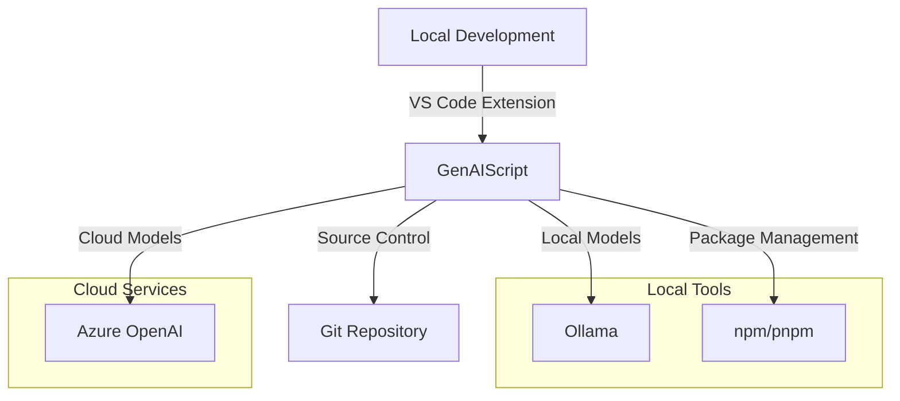
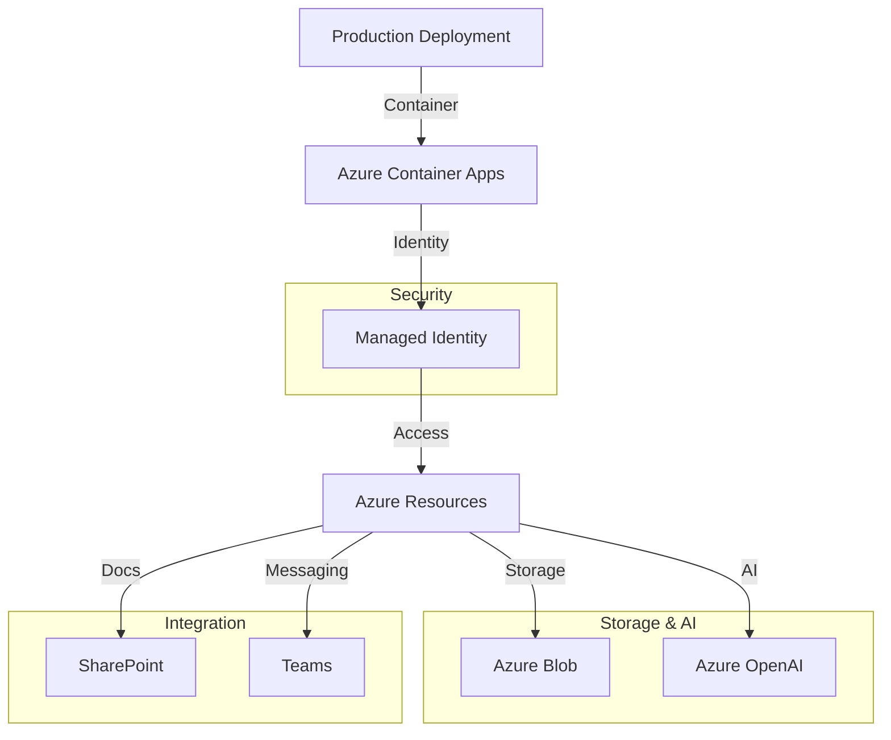

This guide provides detailed instructions for deploying a GenAIScript agent that processes various document formats and integrates with SharePoint and Microsoft Teams. Let's start with the architecture and then move to the deployment steps.

## Architecture Overview



## Required Azure Resources

| Resource Type | Purpose | Configuration |
|--------------|---------|---------------|
| `Microsoft.Storage/storageAccounts` | Document storage | Standard_LRS |
| `Microsoft.CognitiveServices/accounts` | Document processing | S0 tier |
| `Microsoft.DocumentDB/databaseAccounts` | Metadata storage | ServerlessAutoscale |
| `Microsoft.App/containerApps` | Agent hosting | Consumption plan |
| `Microsoft.KeyVault/vaults` | Secret management | Standard tier |
| `Microsoft.OpenAIService/accounts` | AI processing | S0 tier |

## Deployment Steps

### 1. Infrastructure Setup

```bash
# Login to Azure
az login

# Create resource group
az group create --name genaiscript-doc-processor --location eastus

# Deploy infrastructure
az deployment group create \
  --resource-group genaiscript-doc-processor \
  --template-file infra/main.bicep
```

### 2. Agent Configuration

```javascript
// agent-config.genai.mjs
script({
  model: "azure:gpt-4",
  tools: ["documentProcessor", "sharePoint", "teams"]
})

defAgent(
  "docProcessor",
  "Document processing agent",
  {
    tools: [
      "azureBlob",
      "cognitiveServices",
      "sharePoint",
      "teams"
    ]
  }
)
```

### 3. Document Processing Implementation

```javascript
// doc-processor.genai.mjs
const processDocument = async (file) => {
  // Extract content based on file type
  const content = await switch (file.extension) {
    case '.docx': return parsers.DOCX(file);
    case '.pdf': return parsers.PDF(file);
    case '.xlsx': return parsers.XLSX(file);
    case '.md': return parsers.MD(file);
    default: throw new Error('Unsupported format');
  };

  // Generate summary using AI
  const summary = await runPrompt((_) => {
    _.def("CONTENT", content);
    _.$`Generate a concise summary of the CONTENT.`;
  });

  return {
    content,
    summary,
    metadata: extractMetadata(content)
  };
};
```

### 4. SharePoint Integration

```javascript
// sharepoint-upload.genai.mjs
const uploadToSharePoint = async (file, metadata) => {
  const spClient = await host.sharePoint({
    siteUrl: process.env.SHAREPOINT_SITE_URL
  });

  await spClient.uploadFile({
    libraryName: "Documents",
    filePath: file.path,
    metadata: {
      Title: metadata.title,
      Description: metadata.summary,
      Category: metadata.category,
      ProcessedDate: new Date().toISOString()
    }
  });
};
```

### 5. Teams Integration

```javascript
// teams-notification.genai.mjs
const notifyTeams = async (fileInfo) => {
  const teams = await host.teams({
    tenantId: process.env.AZURE_TENANT_ID
  });

  await teams.sendMessage({
    channelId: process.env.TEAMS_CHANNEL_ID,
    message: `New document processed: ${fileInfo.title}`,
    attachments: [{
      content: fileInfo.summary,
      contentType: "text/plain"
    }]
  });
};
```

## Deployment Scenarios

### 1. Development Environment



### 2. Production Environment



## Advanced Integration Examples

### 1. SharePoint Document Processing

```javascript
// Enhanced SharePoint integration
const sharePointProcessor = {
  async processDocument(file) {
    // Extract content and metadata
    const { content, metadata } = await this.extractContent(file);
    
    // Generate AI summary
    const summary = await runPrompt((_) => {
      _.def("CONTENT", content);
      _.$`Generate a comprehensive summary of CONTENT.
          Include key points and recommendations.`;
    });
    
    // Upload to SharePoint with metadata
    await this.uploadToSharePoint(file, {
      Title: metadata.title,
      Summary: summary,
      AIProcessed: true,
      ProcessedDate: new Date().toISOString(),
      Topics: metadata.topics.join(';'),
      Confidence: metadata.confidence
    });
  },
  
  async extractContent(file) {
    // Implementation details...
  },
  
  async uploadToSharePoint(file, metadata) {
    const spClient = await host.sharePoint({
      siteUrl: process.env.SHAREPOINT_SITE_URL,
      library: "AI Processed Documents"
    });
    
    await spClient.upload({
      file,
      metadata,
      overwrite: true,
      notify: true
    });
  }
};
```

### 2. Teams Integration with Adaptive Cards

```javascript
// Rich Teams notifications
const teamsNotifier = {
  async notifyProcessing(document) {
    const teams = await host.teams({
      tenantId: process.env.AZURE_TENANT_ID
    });
    
    const card = {
      type: "AdaptiveCard",
      version: "1.0",
      body: [
        {
          type: "TextBlock",
          text: "New Document Processed",
          size: "large",
          weight: "bolder"
        },
        {
          type: "FactSet",
          facts: [
            {
              title: "Document",
              value: document.name
            },
            {
              title: "Type",
              value: document.type
            },
            {
              title: "Processing Time",
              value: document.processingTime
            }
          ]
        },
        {
          type: "ActionSet",
          actions: [
            {
              type: "Action.OpenUrl",
              title: "View Document",
              url: document.url
            }
          ]
        }
      ]
    };
    
    await teams.sendAdaptiveCard(card);
  }
};
```

## Security Implementation

### 1. Enhanced Authentication

```javascript
// Advanced authentication setup
const setupAuth = async () => {
  const identity = await host.identity({
    type: "managedIdentity",
    resource: process.env.AZURE_RESOURCE_ID
  });
  
  const credentials = await identity.getToken([
    "https://graph.microsoft.com/.default",
    "https://storage.azure.com/.default"
  ]);
  
  return credentials;
};
```

### 2. Content Security

```javascript
// Content security implementation
const securityGuards = {
  async validateContent(content) {
    const safety = await host.contentSafety();
    
    // Check for sensitive information
    const sensitiveInfo = await safety.detectSensitiveInfo(content);
    if (sensitiveInfo.found) {
      throw new Error("Sensitive information detected");
    }
    
    // Validate against content policies
    const policyCheck = await safety.checkContentPolicies(content);
    if (!policyCheck.compliant) {
      throw new Error("Content policy violation");
    }
    
    return true;
  },
  
  async sanitizeOutput(output) {
    const safety = await host.contentSafety();
    return await safety.sanitize(output, {
      removeHtml: true,
      removeScripts: true,
      maxLength: 5000
    });
  }
};
```

## Monitoring and Logging

### 1. Application Insights Integration

```javascript
// Advanced monitoring
const monitoring = {
  async trackOperation(operation) {
    const telemetry = await host.monitor({
      workspace: process.env.LOG_ANALYTICS_WORKSPACE
    });
    
    return await telemetry.trackRequest({
      name: operation.name,
      duration: operation.duration,
      success: operation.success,
      properties: {
        documentType: operation.type,
        processingSteps: operation.steps,
        resultSize: operation.size
      }
    });
  },
  
  async logMetrics(metrics) {
    const monitor = await host.monitor();
    
    await Promise.all(
      Object.entries(metrics).map(([name, value]) =>
        monitor.trackMetric({
          name,
          value,
          timestamp: new Date()
        })
      )
    );
  }
};
```

### 2. Error Handling and Recovery

```javascript
// Robust error handling
const errorHandler = {
  async handleError(error, context) {
    // Log error
    console.error(`Error in ${context}: ${error.message}`);
    
    // Track in Application Insights
    await monitoring.trackOperation({
      name: context,
      success: false,
      error: error.message
    });
    
    // Implement retry logic if appropriate
    if (this.canRetry(error)) {
      return await this.retry(context);
    }
    
    // Notify administrators
    await teamsNotifier.notifyError({
      context,
      error,
      timestamp: new Date()
    });
    
    throw error;
  },
  
  canRetry(error) {
    // Implementation details...
  },
  
  async retry(context) {
    // Implementation details...
  }
};
```

## Azure Services Configuration

### Required Services and Resource Types

1. **Azure Storage**
   ```bicep
   resource storageAccount 'Microsoft.Storage/storageAccounts@2021-09-01' = {
     name: 'genaiscriptdocs'
     location: location
     sku: {
       name: 'Standard_LRS'
     }
     kind: 'StorageV2'
   }
   ```

2. **Azure Cognitive Services**
   ```bicep
   resource cognitiveServices 'Microsoft.CognitiveServices/accounts@2021-04-30' = {
     name: 'genaiscript-cognitive'
     location: location
     sku: {
       name: 'S0'
     }
     kind: 'CognitiveServices'
   }
   ```

3. **Azure OpenAI**
   ```bicep
   resource openAI 'Microsoft.CognitiveServices/accounts@2023-05-01' = {
     name: 'genaiscript-openai'
     location: location
     sku: {
       name: 'S0'
     }
     kind: 'OpenAI'
   }
   ```

## Environment Configuration

```env
# Azure Configuration
AZURE_TENANT_ID=your-tenant-id
AZURE_SUBSCRIPTION_ID=your-subscription-id
AZURE_STORAGE_CONNECTION_STRING=your-connection-string

# OpenAI Configuration
AZURE_OPENAI_API_KEY=your-api-key
AZURE_OPENAI_API_ENDPOINT=your-endpoint

# SharePoint/Teams Configuration
SHAREPOINT_SITE_URL=your-site-url
TEAMS_CHANNEL_ID=your-channel-id

# Cognitive Services
COGNITIVE_SERVICES_KEY=your-key
COGNITIVE_SERVICES_ENDPOINT=your-endpoint
```

## Security Considerations

1. **Authentication**
   - Use Azure Managed Identity
   - Implement proper RBAC
   - Store secrets in Key Vault

2. **Data Protection**
   - Enable encryption at rest
   - Use HTTPS for data in transit
   - Implement proper backup strategies

3. **Compliance**
   - Follow data retention policies
   - Implement audit logging
   - Monitor access patterns

## Monitoring

1. **Azure Monitor Integration**
   ```javascript
   const monitor = await host.monitor({
     workspace: process.env.LOG_ANALYTICS_WORKSPACE
   });

   await monitor.trackEvent({
     name: 'DocumentProcessed',
     properties: {
       documentType: file.type,
       processingTime: duration,
       status: 'success'
     }
   });
   ```

2. **Alert Configuration**
   ```bash
   az monitor alert-rule create \
     --resource-group genaiscript-doc-processor \
     --name doc-processing-failed \
     --condition "count > 5" \
     --window-size 5m
   ```

## Next Steps

1. Implement error handling and retry logic
2. Add support for additional file formats
3. Enhance metadata extraction
4. Implement custom SharePoint columns
5. Add Teams adaptive cards for rich notifications

Get started with deployment:
```bash
# Clone the repository
git clone https://github.com/microsoft/genaiscript
cd genaiscript

# Install dependencies
npm install

# Deploy the solution
npm run deploy
```

For more information and updates, visit the [GitHub repository](https://github.com/microsoft/genaiscript) or join our [Discord community](https://discord.gg/y7HpumjHeB).
