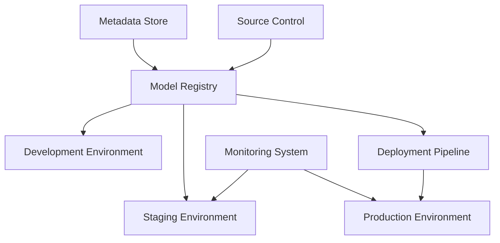
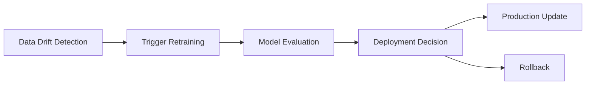
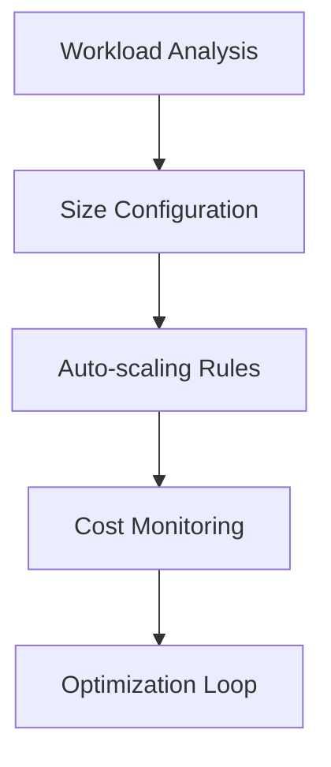
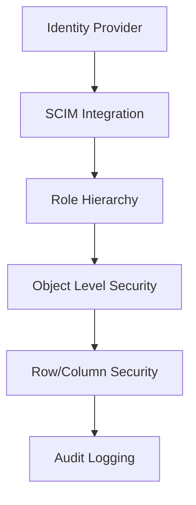
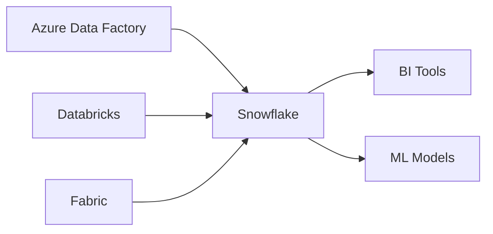

# Advanced Implementation Guide: Snowflake Native Applications
*Level 400 Technical Training Material*

Modern data architectures demand sophisticated approaches to model management, performance optimization, and security. This technical guide provides enterprise-level implementation strategies for Snowflake Native Applications, with particular emphasis on integration patterns across major cloud platforms and industry-leading tools.

## Model Management Framework

### Version Control and Data Lineage


#### Implementation Approaches

1. Python SDK Implementation
```python
from snowflake.snowpark.session import Session
from snowflake.snowpark.functions import col
import snowflake.connector

def initialize_model_tracking():
    # Create model tracking table
    session.sql("""
        CREATE TABLE IF NOT EXISTS MODEL_REGISTRY (
            MODEL_ID VARCHAR,
            VERSION VARCHAR,
            METRICS VARIANT,
            CREATION_TIME TIMESTAMP_NTZ,
            STATUS VARCHAR,
            GIT_COMMIT VARCHAR
        )
    """).collect()

def register_model(model_id, version, metrics):
    session.sql(f"""
        INSERT INTO MODEL_REGISTRY
        SELECT
            '{model_id}',
            '{version}',
            PARSE_JSON('{metrics}'),
            CURRENT_TIMESTAMP(),
            'REGISTERED',
            '{git_commit}'
    """).collect()
```

## Creating ML-Powered Native Apps

### 1. Setup and Prerequisites

```sql
-- Create an application package
CREATE APPLICATION PACKAGE my_ml_app;
USE APPLICATION PACKAGE my_ml_app;

-- Set up necessary schemas
CREATE SCHEMA IF NOT EXISTS models;
CREATE SCHEMA IF NOT EXISTS data;
```

### 2. Training ML Models

```python
# Using Snowpark for model training
from snowflake.ml.modeling import LinearRegression
from snowflake.ml.utils import DataFrameUtils

def train_model(session, training_data):
    # Prepare data
    features = ['feature1', 'feature2', 'feature3']
    target = 'target_column'
    
    # Create and train model
    model = LinearRegression()
    model.fit(training_data[features], training_data[target])
    
    # Save model to Snowflake
    model.save(session, 'models.my_prediction_model')
```

### 3. Model Deployment

```sql
-- Create stored procedure for model inference
CREATE PROCEDURE predict_values(input_data VARIANT)
    RETURNS TABLE(prediction FLOAT)
    LANGUAGE PYTHON
    RUNTIME_VERSION = '3.10'
    PACKAGES = ('snowflake-ml-python')
    HANDLER = 'run_prediction'
AS
$$
from snowflake.ml.model import Model

def run_prediction(session, input_data):
    # Load model
    model = Model.load(session, 'models.my_prediction_model')
    
    # Make predictions
    predictions = model.predict(input_data)
    return predictions
$$;
```

### 4. Application Integration

```sql
-- Create application interface
CREATE APPLICATION my_ml_app
  FROM APPLICATION PACKAGE my_ml_app
  USING VERSION V1
  WITH DEFAULT_ROLE = 'APP_PUBLIC';

-- Grant necessary privileges
GRANT USAGE ON PROCEDURE predict_values(VARIANT)
  TO APPLICATION ROLE app_public;
```

## Using ML Models in Apps

### 1. Model Training Workflow

```python
# Example training workflow
def create_training_workflow():
    return f"""
    CREATE OR REPLACE TASK train_model_task
        WAREHOUSE = compute_wh
        SCHEDULE = '0 0 * * *'  -- Daily at midnight
    AS
    CALL train_model_procedure();
    """

# Training procedure
def train_model_procedure():
    """
    1. Load and prepare data
    2. Train model
    3. Validate results
    4. Deploy new version
    """
    pass
```

### 2. Model Inference

```python
# Real-time inference example
def predict(session, data):
    """
    Make predictions using deployed model
    """
    result = session.sql(f"""
        CALL predict_values(:1)
    """, params=[data]).collect()
    return result

# Batch inference example
def batch_predict(session, table_name):
    """
    Run batch predictions on a table
    """
    result = session.sql(f"""
        INSERT INTO predictions
        SELECT id, predict_values(features)
        FROM {table_name}
    """).collect()
    return result
```

## Best Practices

### 1. Model Management
- Version control models and data
- Implement model monitoring
- Set up automated retraining
- Track model performance metrics

### 2. Performance Optimization
- Use appropriate warehouse sizes
- Implement caching strategies
- Optimize data preprocessing
- Monitor resource usage

### 3. Security Considerations
- Implement proper access controls
- Secure sensitive training data
- Monitor model access patterns
- Regular security audits

## Integration Examples

### 1. Time Series Forecasting

```python
from snowflake.ml.modeling import Prophet

def create_forecast_model():
    # Create and train Prophet model
    model = Prophet()
    model.fit(data)
    return model

def deploy_forecast_model(model, session):
    # Save and deploy the model
    model.save(session, 'models.forecast_model')
```

### 2. Classification Tasks

```python
from snowflake.ml.modeling import RandomForestClassifier

def create_classifier():
    # Create and train classifier
    model = RandomForestClassifier()
    model.fit(X_train, y_train)
    return model

def deploy_classifier(model, session):
    # Save and deploy the classifier
    model.save(session, 'models.classifier_model')
```

## Monitoring and Maintenance

### 1. Performance Tracking

```sql
CREATE OR REPLACE VIEW model_metrics AS
SELECT 
    model_id,
    prediction_timestamp,
    actual_value,
    predicted_value,
    ABS(actual_value - predicted_value) as error
FROM prediction_logs;
```

### 2. Automated Monitoring

```python
def setup_monitoring():
    """
    Set up automated model monitoring
    """
    monitoring_query = """
    CREATE OR REPLACE TASK monitor_model_performance
        WAREHOUSE = compute_wh
        SCHEDULE = '0 * * * *'  -- Hourly
    AS
    CALL check_model_performance();
    """
    return monitoring_query
```

## Links and Resources

### Documentation
- [Snowflake ML Documentation](https://docs.snowflake.com/en/developer-guide/snowflake-ml/overview)
- [Native Apps Guide](https://docs.snowflake.com/en/developer-guide/native-apps/overview)
- [ML Model Management](https://docs.snowflake.com/en/developer-guide/snowflake-ml/model-management)

### Tutorials
- [Getting Started with ML](https://quickstarts.snowflake.com/guide/getting_started_with_snowflake_ml)
- [Building Native Apps](https://quickstarts.snowflake.com/guide/native_apps_getting_started)
- [Model Deployment](https://quickstarts.snowflake.com/guide/deploying_ml_models)

2. Snowflake CLI Integration
```bash
snowsql -c myconn -q "
CREATE OR REPLACE PROCEDURE REGISTER_MODEL(
    MODEL_ID STRING, 
    VERSION STRING,
    METRICS VARIANT
)
RETURNS STRING
LANGUAGE PYTHON
RUNTIME_VERSION = '3.8'
PACKAGES = ('snowflake-snowpark-python')
HANDLER = 'register_model'
AS
$$
def register_model(snowpark_session, model_id, version, metrics):
    snowpark_session.sql(f\"\"\"
        INSERT INTO MODEL_REGISTRY ...
    \"\"\").collect()
    return 'SUCCESS'
$$
"
```

### Automated Retraining Pipeline


#### Azure Integration Pattern
```python
from azure.ai.ml import MLClient
from snowflake.connector import connect

def setup_azure_snowflake_pipeline():
    # Azure ML workspace connection
    ml_client = MLClient(
        credential=credential,
        subscription_id=subscription_id,
        resource_group_name=resource_group,
        workspace_name=workspace_name
    )
    
    # Snowflake connection
    snow_conn = connect(
        user=user,
        password=password,
        account=account,
        warehouse=warehouse,
        database=database
    )
```

## Performance Optimization Strategies

### Warehouse Management


#### Implementation Using Snowflake Scripting
```sql
CREATE OR REPLACE PROCEDURE OPTIMIZE_WAREHOUSE()
RETURNS VARCHAR
LANGUAGE JAVASCRIPT
EXECUTE AS CALLER
AS
$$
    var result = [];
    
    // Monitor query patterns
    var monitoring_sql = `
        SELECT WAREHOUSE_NAME,
               AVG(EXECUTION_TIME) as AVG_EXEC_TIME,
               COUNT(*) as QUERY_COUNT
        FROM TABLE(INFORMATION_SCHEMA.QUERY_HISTORY())
        WHERE START_TIME >= DATEADD(hours, -24, CURRENT_TIMESTAMP())
        GROUP BY 1
    `;
    
    var stmt = snowflake.createStatement({sqlText: monitoring_sql});
    var res = stmt.execute();
    
    // Implement auto-scaling logic
    while (res.next()) {
        var warehouse = res.getColumnValue(1);
        var avg_time = res.getColumnValue(2);
        var query_count = res.getColumnValue(3);
        
        // Auto-scaling decision logic
        if (avg_time > 300 && query_count > 100) {
            result.push("Scaling up warehouse: " + warehouse);
            var scale_sql = "ALTER WAREHOUSE " + warehouse + 
                          " SET MIN_CLUSTER_COUNT = 2, MAX_CLUSTER_COUNT = 6";
            snowflake.execute({sqlText: scale_sql});
        }
    }
    
    return result.join("\n");
$$;
```

### Caching Strategy Implementation
```python
from snowflake.snowpark import Session
from snowflake.snowpark.functions import col

def implement_caching_strategy(session: Session):
    # Configure result caching
    session.sql("""
        ALTER SESSION SET USE_CACHED_RESULT = TRUE;
        ALTER SESSION SET LOCAL_CACHING = TRUE;
    """).collect()
    
    # Implement materialized views for frequent queries
    session.sql("""
        CREATE OR REPLACE MATERIALIZED VIEW FREQUENT_QUERY_CACHE AS
        SELECT 
            DATE_TRUNC('hour', event_time) as hour,
            COUNT(*) as event_count,
            AVG(metric_value) as avg_metric
        FROM event_stream
        GROUP BY 1
    """).collect()
```

## Security Architecture

### Access Control Framework


#### Automated Security Implementation
```python
from snowflake.connector.connection import SnowflakeConnection
import snowflake.connector

def setup_security_framework(conn: SnowflakeConnection):
    # Create security admin role
    conn.cursor().execute("""
        CREATE ROLE IF NOT EXISTS SECURITY_ADMIN;
        GRANT ROLE SECURITY_ADMIN TO ROLE ACCOUNTADMIN;
    """)
    
    # Implement row access policies
    conn.cursor().execute("""
        CREATE OR REPLACE ROW ACCESS POLICY data_access_policy
        AS (department STRING) RETURNS BOOLEAN ->
            CURRENT_ROLE() IN ('ADMIN', 'SECURITY_ADMIN') OR
            EXISTS (
                SELECT 1 FROM user_departments
                WHERE user_id = CURRENT_USER()
                AND department = department
            )
    """)
```

## Enterprise Architecture Patterns

### Multi-Cloud Integration


### Notable Enterprise Implementations

1. Shopify (E-commerce Platform)
   - Architecture: Snowflake + Databricks
   - Executive: Harley Finkelstein, President
   - Website: https://www.shopify.com
   - Stack: Azure Data Factory, Snowflake, Databricks

2. Wealthsimple (Financial Technology)
   - Architecture: Snowflake + Azure
   - Executive: Michael Katchen, CEO
   - Website: https://www.wealthsimple.com
   - Stack: Azure Synapse, Snowflake, Power BI

3. Lightspeed Commerce (Point of Sale Solutions)
   - Architecture: Snowflake + Fabric
   - Executive: JP Chauvet, CEO
   - Website: https://www.lightspeedhq.com
   - Stack: Microsoft Fabric, Snowflake, Azure ML

## Getting Started with Snowflake on Azure

### Initial Setup
```bash
# Using Snowflake CLI
snowsql config set connections.dev.accountname myaccount
snowsql config set connections.dev.username myuser
snowsql config set connections.dev.region azure-east-us-2

# Using Azure CLI
az snowflake account create \
    --name myaccount \
    --resource-group mygroup \
    --location eastus2
```

### Infrastructure as Code Template
```yaml
# snowflake.yml
resources:
  warehouses:
    compute_wh:
      size: x-large
      auto_suspend: 300
      auto_resume: true
      scaling_policy:
        min_clusters: 1
        max_clusters: 3
```

### Cost Management Implementation
```python
def monitor_costs():
    session.sql("""
        CREATE OR REPLACE PROCEDURE COST_MONITORING()
        RETURNS TABLE (warehouse_name STRING, cost FLOAT)
        LANGUAGE PYTHON
        RUNTIME_VERSION = '3.8'
        HANDLER = 'process'
        AS
        $$
        def process(snowpark_session):
            return snowpark_session.sql("""
                SELECT 
                    warehouse_name,
                    SUM(credits_used * 3) as estimated_cost
                FROM snowflake.account_usage.warehouse_metering_history
                WHERE start_time >= DATEADD('day', -1, CURRENT_TIMESTAMP())
                GROUP BY 1
            """).collect()
        $$
    """).collect()
```

## Third-Party Ecosystem

### Integration Partners
1. dbt Labs
   - Purpose: Data transformation
   - Website: https://www.getdbt.com

2. Fivetran
   - Purpose: Data pipeline automation
   - Website: https://www.fivetran.com

3. Sigma Computing
   - Purpose: Cloud analytics
   - Website: https://www.sigmacomputing.com

### Monitoring Tools
1. DataDog
   - Purpose: Performance monitoring
   - Implementation:
     ```python
     from datadog_api_client import ApiClient, Configuration
     
     def setup_monitoring():
         configuration = Configuration()
         with ApiClient(configuration) as api_client:
             api_instance = MetricsApi(api_client)
             api_instance.submit_metrics(
                 metric_name="snowflake.warehouse.usage",
                 points=[(time.time(), warehouse_usage)],
                 tags=["env:prod"]
             )
     ```

## GitHub Actions Automation

### Deployment Workflow
```yaml
name: Snowflake Deployment
on:
  push:
    branches: [main]

jobs:
  deploy:
    runs-on: ubuntu-latest
    steps:
      - uses: actions/checkout@v2
      - name: Deploy to Snowflake
        uses: snowflake-actions/deploy@v1
        with:
          account: ${{ secrets.SNOWFLAKE_ACCOUNT }}
          username: ${{ secrets.SNOWFLAKE_USER }}
          password: ${{ secrets.SNOWFLAKE_PASSWORD }}
          database: PRODUCTION
          role: SYSADMIN
```

### Maintenance Automation
```python
from prefect import task, Flow
from prefect.schedules import CronSchedule

@task
def vacuum_tables():
    session.sql("SELECT SYSTEM$VACUUM_ALL_TABLES()").collect()

@task
def optimize_statistics():
    session.sql("ANALYZE TABLE mytable").collect()

with Flow("maintenance", schedule=CronSchedule("0 0 * * *")) as flow:
    vacuum = vacuum_tables()
    stats = optimize_statistics()
    stats.set_upstream(vacuum)
```

This comprehensive guide provides a foundation for implementing enterprise-grade Snowflake Native Applications. For specific implementation details or customization requirements, consult the official Snowflake documentation or engage with certified Snowflake partners.
